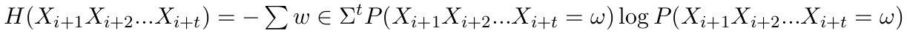
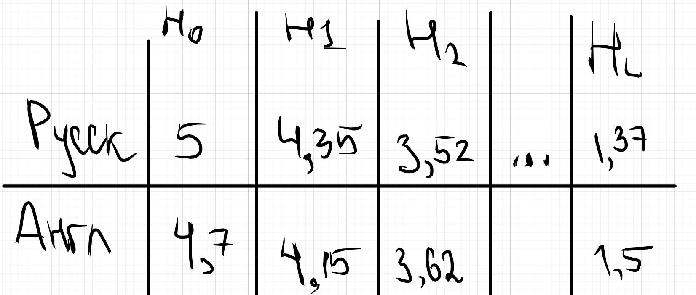

## Опр(Стационарная модель открытого текста)
**Стационарная модель открытого текста** - это последовательность случайных величин $x_1,x_2, \cdots$>, таких что

* x_i распределена на $\Sigma$,

* $\forall w \in \Sigma^k$, $\forall i,j \in \natnums:P(x_{i+1},x_{i+2}, \cdots, x_{i+k}=w) = P(x_{j+1},x_{j+2}, \cdots x_{j+k},)$

* Вероятности появления символов/биграмм/н-грамм не зависят от их позиции в тексте, т.е $\forall k$ на $\Sigma^k$ задано распределение вероятностей, работающее для любых подпоследовательностей длины k

## Замечание 1
$\forall i,j,k \in \natnums: H(x_{i+1}, x_{i+2}, \cdots ,x_{i+k}) = H(x_{j+1}, x_{j+1}, \cdots, x_{j+1},)$
## Д-ВО
Подставим в опр энтропии эти вероятности

$\blacksquare$

## Замечание 2
$\forall i,j,k,s \in \natnums$:

$H(x_{i+s+1},x_{i+s+2},\cdots, x_{i+s+k} | x_{i+1},x_{i+2},\cdots, x_{i+s})$ =

$H(x_{j+s+1},x_{j+s+2},\cdots, x_{j+s+k} | x_{j+1},x_{j+2},\cdots, x_{j+s})$

## Д-ВО

Переименуем:

* $X = x_{i+s+1},x_{i+s+2},\cdots, x_{i+s+k}$
* $Y = x_{i+1},x_{i+2},\cdots, x_{i+s}$

**По цепному правилу получаем, что $H(X|Y) = H(X,Y)-H(Y)$**

Переименуем:

* $Z = x_{j+s+1},x_{j+s+2},\cdots, x_{j+s+k}$
* $E = x_{j+1},x_{j+2},\cdots, x_{j+s}$

**По цепному правилу получаем, что $H(Z|E) = H(Z,E)-H(E)$**

Правые части равны по 1ому замечанию $=> H(Z|E) = H(X|Y)$

$\blacksquare$

можем ввести обозначение $x_{i+1}, \cdot ,x_{i+k} = x^k$ т.к распределение вероятностей не зависит от i и j, а зависит только от k

## ОПР(Условная взаимная информация)
$I(X\leftrightarrow Y |Z) = H(X|Z) + H(Y|Z) - H(X,Y|Z)$

# Теорема
$I(X\leftrightarrow Y |Z) \ge 0$

## Д-ВО (как в теореме о взаимной информации)

# Теорема для стационарного источника открытого текста

1. $H(x|x^n)=H(x_{i+n+1} |x_{i+1}, x_{i+2}, \cdots, x_{i+n}) \searrow$

2. $H_n(x) =\frac{H(x^n)}{n}\searrow$

3. $H_n(x) \ge H(x|x^{n-1})$

4. $\lim\limits_{n\to \infty} H_n(x) = \lim\limits_{n\to\infty}H(x|x^n)$

## Д-ВО 1

Знаем, что $H(X|Z) - H(X|Y,Z) = I(X\leftrightarrow Y|Z) \ge 0 \Rightarrow$ 
   * $H(x|x^{n-1}) - H(x|x^n) \ge 0$

$\blacksquare$

## Д-ВО 2
$H(x_1, \cdots, x_n)$ = [цепное правило] =

$H(x_1, \cdots x_{n-1}) + H(x_n|x_1 \cdots x_{n-1})$=

* цепное правило применяем много раз, раскладывая энтропию

$H(x_1) + \cdots + H(x_2|x_1) + H(x_3|x_2x_1)+\cdots+ H(x_n|x_1, \cdots x_{n-1})$=

* Поменяли индексы из-за стационарности

$H(x_n) + H(x_n|x_{n-1})+ H(x_n|x_{n-2}x_{n-1}) +  \cdots + H(x_n|x_1 ...x_{n-1}) \ge$

* оценили снизу самым маленьким слагаемым. Самое маленькое по 1 пункту теоремы, т.к в нём больше всего условий
  
$n \cdot H(x_n|x_1, \cdots x_{n-1})$

$\measuredangle H(x_1, \cdots x_n) = H(x_1, \cdots x_{n-1}) + H(x_n| x_1 \cdots x_{n-1}) \le$

$H(x_1, \cdots, x_{n-1}) + \frac{1}{n}\cdot H(x_1, \cdots x_n);$

* все слагаемые с n переносим влево

$\frac{n-1}{n}\cdot H(x_1, \cdots , x_n) \le H(x_1, \cdots x_{n-1})$

$\frac{H(x_1, \cdots , x_n)}{n} \le \frac{H(x_1, \cdots x_{n-1})} {(n-1)}$

$\blacksquare$

## Д-ВО 3
$H(x_1, \cdots, x_n)$ = [цепное правило] =

$H(x_1, \cdots x_{n-1}) + H(x_n|x_1 \cdots x_{n-1})$=

* цепное правило применяем много раз, раскладывая энтропию

$H(x_1) + \cdots + H(x_2|x_1) + H(x_3|x_2x_1)+\cdots+ H(x_n|x_1, \cdots x_{n-1})$=

* Поменяли индексы из-за стационарности

$H(x_n) + H(x_n|x_{n-1})+ H(x_n|x_{n-2}x_{n-1}) +  \cdots + H(x_n|x_1 ...x_{n-1}) \ge$

* оценили снизу самым маленьким слагаемым. Самое маленькое по 1 пункту теоремы, т.к в нём больше всего условий
  
$n \cdot H(x_n|x_1, \cdots x_{n-1})$

получаем, что $H(x_1, x_2, \cdots x_n) \ge n\cdot H(x_n|x_1, \cdots x_{n-1}) \Rightarrow H_n(x)\ge H(x_n|x_1, \cdots x_{n-1})$

$\blacksquare$

## Д-ВО 4

$H_n(x)\searrow$ и $H_n(x) \ge 0$, т.к энтропия $\ge 0$

$\exist \lim\limits_{n \to \infty} H_n(x)$ по Т.Вейерштрасса

Аналогично $\exists \lim\limits_{n \to \infty} H(x|x^n)$

* по пункту 3 

$\lim\limits_{n \to \infty}H_n(x) \ge \lim\limits_{n \to \infty} H(x|x^n)$

Д-жем, $\lim\limits_{n \to \infty} H_n(x) \le \lim\limits_{n \to \infty} H(x|x^n)$

$\measuredangle H(x^n) = H(x_1, \cdots x_n) = H(x_1, \cdots x_m) + H(x_{m+1}, \cdots, x_n|x_1, \cdots m)$=

* применяем цепное правило для условной энтропии к $H(x_{m+1}, \cdots, x_n|x_1, \cdots m)$ много раз
  
* $H(x_1, \cdots x_m) = m \cdot H_m(x)$
  
$m \cdot H_m(x) + H(x_{m+1}|x_1, \cdots x_m) + H(x_{m+2}|x_1, \cdots, x_{m+1}) + H(x_n|x_1, \cdots, x_{n-1}) \le$ 

* оценили самым большим слагаемым $H(x|x^m)$ в силу 1
  
$m\cdot H_m(x) + (n-m)\cdot H(x|x^m)$

Получили

$\forall n, m\le n: H(x^n) \le m\cdot H_m(x) + (n-m)\cdot H(x|x^m)$

* поделим на n

$H_n(x^n) \le \frac{m}{n}\cdot H_m(x) + \frac{(n-m)}{n}\cdot H(x|x^m)$

* т.е $\forall n, m\le n$, то выберем $m = \frac{n}{2}$

$H_{2m}(x^n) \le \frac{1}{2}\cdot H_m(x) + \frac{1}{2}\cdot H(x|x^m)$

* переходим к пределу по m

$\lim\limits_{m \to \infty} H_m(x) \le \frac{1}{2}\lim\limits_{m \to \infty} H_m(x) + \frac{1}{2} \lim\limits_{m \to \infty} H(x|x^m) \Rightarrow$

$\lim\limits_{m \to \infty} H_m(x) \le  \lim\limits_{m \to \infty} H(x|x^m) \Rightarrow$ 

$\lim\limits_{n \to \infty} H_n(x) \le  \lim\limits_{n \to \infty} H(x|x^n)$ 

$\blacksquare$

## ОПР(Энтропия языка)
Энтропия языка L: $H_L = \lim\limits_{n \to \infty} H_n(x)$

Пусть: 
* $H_0(x) = log(|\Sigma|)$
* $H_1(x) = - \sum_{i=0}^{l-1} p_i\cdot log(p_i)$

## ОПР(Избыточность языка)

Избыточность языка L это $R_L = 1 - \frac{H_L}{log(|\Sigma|)}= 1 - \frac{H_L}{H_0}$

* Это доля неиспользуемой выразительной способности каждой буквы

Для русского языка $R_L = 73\%$

Для английского языка $R_L = 68\%$

# Cпроси, что еще можно рассказать про избыточность