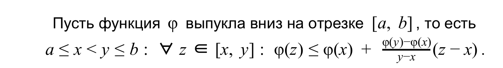

Пусть случайная величина K - произвольно распределена на $\mathcal{K}$

### воспоминания о выпуклостях 

## Неравенство Йенсена
Если f(x) - выпукла на [a,b]

Тогда $\forall \vec{\alpha} =(\alpha_1, \alpha_2 \cdots \alpha_k )$ -стохастического вектора, $\forall x_1, x_2, \cdots x_k \in [a,b]:$
$$f(\sum\limits_{i=1}^k \alpha_i \cdot x_i)\le \sum\limits_{i=1}^k \alpha_i \cdot f(x_i)$$

### Д-ВО

**Первая база индукции k = 1**

$f(x_1) = f(x_1)$

**Вторая база индукции k = 2** 
# Обязательно ли нужно показывать вторую базу, если есть первая

Б.Б.О $x_1 < x_2$

т.е надо показать что 
$$f(\alpha_1 \cdot x_1 + \alpha_2 \cdot x_2) \le \alpha_1 \cdot f(x_1) + \alpha_2 \cdot f(x_2)$$

* очевидно что:
   
$\alpha_1 \cdot x_1 + \alpha_2 \cdot x_1 < \alpha_1 \cdot x_1 + \alpha_2 \cdot x_2 < \alpha_1 \cdot x_2 + \alpha_2 \cdot x_2$

где
* $\alpha_1 \cdot x_1 + \alpha_2 \cdot x_1 = x_1$
* $\alpha_1 \cdot x_2 + \alpha_2 \cdot x_2 = x_2$

**пусть тогда $\alpha_1 \cdot x_1 + \alpha_2 \cdot x_2 = x$**. получаем, что $x_1 < x < x_2$

пусть 

* $\alpha_1 = \alpha$
* $1-\alpha = \alpha_2$

т.к f(x) - выпукла, то:

$f(x) \le f(x_1) + \frac{(f(x_2) - f(x_1))}{x_2-x_1}\cdot(x-x_1)$

* где $(x-x_1) = (1-\alpha)\cdot(x_2-x_1)$ 

$f(x) \le f(x_1) + (f(x_2) - f(x_1))\cdot(1-\alpha) = $

$\alpha_1 \cdot f(x_1) + \alpha_2 \cdot f(x_2)$

**Ш.И $k \to k+1$**

нужно доказать $f(\alpha_1 x_1 + \cdots + \alpha_k x_k + \alpha_{k+1} x_{k+1}) \le \alpha_1 f(x_1) + \cdots \alpha_k f(x_k) + \alpha_{k+1} f(x_{k+1})$

**Сделаем переобозначение для иксов**

* $y_1 = x_1$
* $y_2 = x_2$
* $\cdots$
* $y_k = x_k$
* $y_{k+1} = \frac{\alpha_k x_k + \alpha_{k+1} x_{k+1}}{\alpha_k + \alpha_{k+1}}$

заметим,что ($\frac{\alpha_k}{\alpha_k + \alpha_{k+1}}$, $\frac{\alpha_{k+1}}{\alpha_k + \alpha_{k+1}}$) - стохастический вектор

точка $y_k \in [x_k, x_{k+1}] \Rightarrow y_k \in [a, b]$

**теперь переобозначаем альфы**

* $\beta_1 = \alpha_1$

* $\beta_2 = \alpha_2$

* $\cdots$

* $\beta_{k-1} = \alpha_{k-1}$
* $\beta_{k} = \alpha_{k} + \alpha_{k-1}$

тогда $(\beta_1, \cdots \beta_k)$ - стохастический вектор

По П.И имеем неравенство $f(\alpha_1 x_1 + \cdots + \alpha_k x_k) \le \alpha_1 f(x_1) + \cdots \alpha_k f(x_k) = f(\beta_1 y_1 + \cdots + \beta_k y_k)$

$\beta_1 \cdot f(y_1) + \cdots + \beta_{k-1}f(y_{k-1}) +\beta_k f(y_k) =$

$\alpha_1 \cdot f(x_1) + \cdots + \alpha_{k-1} f(x_{k-1}) +(\alpha_k + \alpha_{k+1})f(\frac{\alpha_k x_k}{\alpha_k + \alpha_{k+1}} + \frac{\alpha_{k+1} x_{k+1}}{\alpha_k + \alpha_{k+1}}) =$

* по Б.И № 2 и используем Ш.И для $(\frac{\alpha_{k+1} x_{k+1}}{\alpha_k + \alpha_{k+1}})$

$\alpha_1 \cdot f(x_1) + \cdots + \alpha_{k-1} f(x_{k-1}) + \alpha_k f(x_k) + \alpha_{k+1}f(x_{k+1})$

$\blacksquare$

# Утверждение 3

$log(P_{им}) \ge -I(K \leftrightarrow C)$

## Д-ВО

пусть $c \in \mathcal{C}$ - допустимая, если $D(c,k)\in \mathcal{M}$, где k - это ключ, который сейчас используют A и B

$0 \le P(c - допустимая)$ = $\sum\limits_{k \in \mathcal{K}}P(c-допустимая | K = k) \cdot P(K=k) =$
* если ключ известен, то $P(c-допустимая | K = k)$ либо 0 либо 1.

$\delta(c,k) = \begin{cases}
    1, D(c,k) \in \mathcal{M} \\
    0,  D(c,k) \notin \mathcal{M}
\end{cases}$

$\sum\limits_{k \in \mathcal{K}}P(c-допустимая | K = k) \cdot P(K=k) \cdot \delta(c,k)=$

* если щас уберем $P(c-допустимая | K = k)$ то ничего не изменится, т.к умножили на $\delta(c,k)$
* $\delta(c,k)$ это и есть $P(c-допустимая | K = k)$

$\sum\limits_{k \in \mathcal{K}} P(K=k) \cdot \delta(c,k)=$

$\measuredangle Q_c(k) = \frac{P(K=k)\cdot \delta(c,k)}{P(c - допустимая)}$

Вектор ($Q_c(K)|k\in \mathcal{K}$) - стохастический. 
## Спроси почему этот вектор стохастический. Использовали равенство, показанное выше

$P(C=c) = \sum\limits_{k\in \mathcal{K}}P(C=c|K=k) \cdot P(K=k) =$

* Домножаем на $\delta(c,k). После домножения ничего не меняется$

$\sum\limits_{k\in \mathcal{K}}P(C=c|K=k) \cdot P(K=k)\cdot \delta(c,k) =$

* подставляем $Q_c(k)$

$P(c-допустимая)\cdot \sum\limits_{k\in \mathcal{K}}P(C=c|K=k) \cdot Q_c(k) =$

$\forall c \in \mathcal{C} \measuredangle \  P(C=c)\cdot log(P(C=c)) =$
 
$P(C=c)\cdot log(P(c-допустимая)) + P(C=c)\cdot log(\sum\limits_{k\in \mathcal{K}}P(C=c|K=k) \cdot Q_c(k)) =$

* распишем $P(C=c)$ у правого множителя

$P(C=c)\cdot log(P(c-допустимая)) + \lgroup P(c-допустимая)\cdot \sum\limits_{k\in \mathcal{K}}P(C=c|K=k) \cdot Q_c(k)\rgroup \cdot log(\sum\limits_{k\in \mathcal{K}}P(C=c|K=k) \cdot Q_c(k)) \le$

* функция $t \cdot log(t)$выпукла вниз, поэтому используем н-во йенсена
  
$P(C=c)\cdot log(P(c-допустимая)) + P(c-допустимая)\cdot \sum\limits_{k \in \mathcal{K}}Q_c(k)P(C=c|K=k)log(P(C=c|K=k)) =$

* подставили $Q_c(k)$

$P(C=c)\cdot log(P(c-допустимая)) + \sum\limits_{k \in \mathcal{K}}\delta(c,k)\cdot P(K=k)\cdot P(C=c|K=k)log(P(C=c|K=k)) =$

* $P(K=k)\cdot P(C=c|K=k) = P(C=c,K=k)$
* можем стереть $\delta(c,k)$, т.к если оно 1, то ничего не изменится, а если оно 0, то $P(C=c| K=k)=0$

$P(C=c)\cdot log(P(c-допустимая)) + \sum\limits_{k \in \mathcal{K}}P(K=k,C=c) \cdot log(P(C=c|K=k)) =$

* В итоге получаем $\forall c\in \mathcal{C}$ н-во: 

$$P(C=c)\cdot log(P(C=c))\le$$ 

$$P(C=c)\cdot log(P(c-допустимая)) + \sum\limits_{k \in \mathcal{K}}P(K=k,C=c) \cdot log(P(C=c|K=k))$$

* складываем это н-во по всем $c \in \mathcal{C}$

$\sum\limits_{c\in\mathcal{C}}P(C=c)\cdot log(P(C=c)) \le$

$\sum\limits_{c \in \mathcal{C}}P(C=c)log(P(c-допустимая)) + \sum\limits_{c \in \mathcal{C}}\sum\limits_{k \in \mathcal{K}}P(K=k, C=c)log(P(C=c|K=k))$

* $\sum\limits_{c\in\mathcal{C}}P(C=c)\cdot log(P(C=c)) = -H(C)$
* $\sum\limits_{c \in \mathcal{C}}\sum\limits_{k \in \mathcal{K}}P(K=k, C=c)log(P(C=c|K=k)) = -H(C|K)$

$-H(C) \le \sum\limits_{c \in \mathcal{C}}P(C=c)log(P(c- допустимая)) - H(C|K) \le$

* оценили $log(P(c- допустимая)) \le \ \max\limits_{c\in \mathcal{C}}\{log(P(с-допустимая))\}$

$\sum\limits_{c \in \mathcal{C}}P(C=c) \max\limits_{c\in \mathcal{C}}\{log(P(с-допустимая))\} - H(C|K) \le$

* т.к логорифм функция возрастающая, то максимум логорифма это логорифм максимума

$log\{\max\limits_{c \in \mathcal{C}}P(c-допустимая)\}\cdot \sum\limits_{c\in\mathcal{C}}P(C=c) - H(C|K) = $

* $\max\limits_{c \in \mathcal{C}}P(c-допустимая) = P_{им}$
* $\sum\limits_{c\in\mathcal{C}}P(C=c) = 1$

$log(P_{им}) - H(C|K)$

В итоге получаем, что:
$$H(C|K) - H(C) \le log(P_{им})$$

* применяем цепное правило к H(C|K)
* Используем терему о взаимной информации

$H(C,K) - H(K) - H(C) = I(C\leftrightarrow K)$

$\blacksquare$

## Смысл утверждения 3 

Чтобы уменьшить $P_{им}$ надо увеличить $I(K\leftrightarrow C)$.

$I(K \leftrightarrow C)$ - мера того, в какой степени ключ используется для защиты от атаки имитации.

## ОПР (шифр совершенной имитационной стойкостью)

**Шифр обладает совершенной имитационной стойкостью**, если $log(P_{им}) = - I(K \leftrightarrow C ) \Rightarrow P_{им} = (\frac{1}{2})^{I(K\leftrightarrow C)}$
