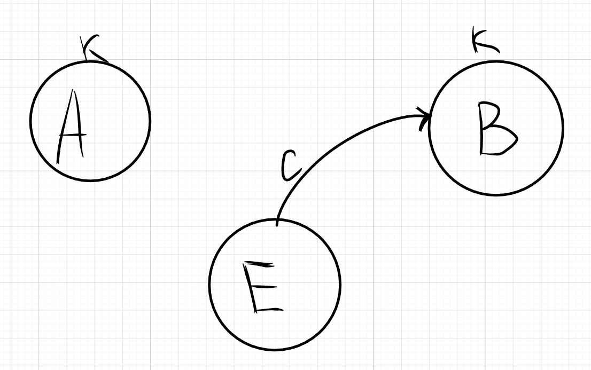
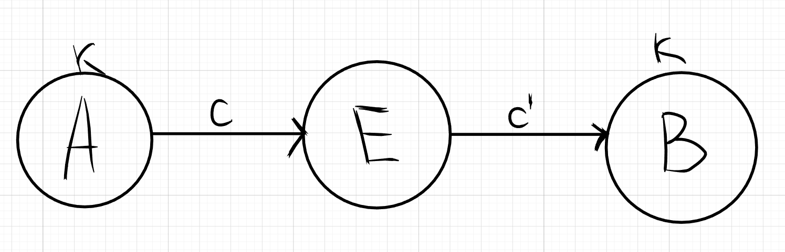
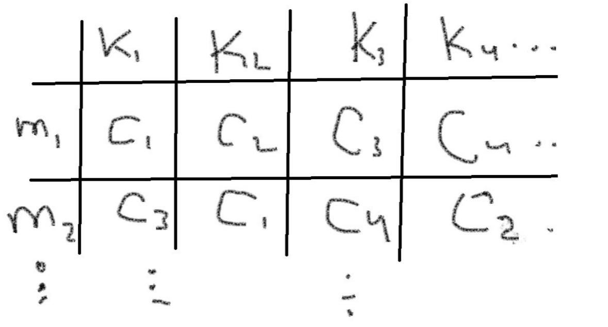
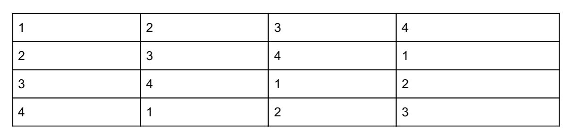

# Модель атаки имитации

Известная всем КС - $(\mathcal{M}, \mathcal{C},\mathcal{K},E,D)$

Есть 2 абонента, которые обмениваются сообщениями(Алиса А и Боб Б) с помощью секретного ключа k

Есть криптоаналитик Ева, который хочет напакостить. Она отправляет Бобу криптограмму c. **Атака имитации считается успешной, если $D(c, k) \in \mathcal{M}$**, т.е У Боба получилось расшифровать криптограмму и получить открытый текст.

Вероятность успеха атаки имитации это $P(D(c, k) \in \mathcal{M})$. Ева пытается увеличить её, выбирая подходящие криптограмы с

## ОПР(вероятность атаки имитации)

**вероятность атаки имитации** $P_{им}$ $\max\limits_{c \in \mathcal{C}}\{P(D(c,k)\in\mathcal{M})\}$

# Модель атаки подмены

Известная всем КС - $(\mathcal{M}, \mathcal{C},\mathcal{K},E,D)$

Есть 2 абонента, которые обмениваются сообщениями(Алиса А и Боб Б) с помощью секретного ключа k

Есть криптоаналитик Ева, который хочет напакостить. Она перехвататывает криптограмму Алисы **c** и отправляет Бобу криптограмму **c'**.

## ОПР(Вероятность успеха атаки подмены)

**Вероятность успеха атаки подмены** $P_{подм} = \max\limits_{\substack{(c,c')\in \mathcal{C}^2 \\ c \neq c'}}\{P(D(c', k) \in \mathcal{M}|D(c,k)\in \mathcal{M})\}$

## ОПР (Вероятность навязывания)

$P_{навяз} = \max\{P_{подм}, P_{им}\}$

**Пусть все ключи будут равновероятными**, т.е $\forall k \in \mathcal{K}: P(K=k) = \frac{1}{|\mathcal{K}|}$

## Утверждение 1

$P_{им} \ge \frac{|\mathcal{M}|}{|\mathcal{C}|}$

### Д-ВО

Берём $c \in \mathcal{C}$.

**Определим** $K(c) = \{k\in \mathcal{K}| D(c,k) \in \mathcal{M} \}$

Т.к все ключи равновероятны, то  $P(D(c, k) \in \mathcal{M}) = \frac{|K(c)|}{|\mathcal{K}|}$ 

$P_{им} = \max\limits_{c\in \mathcal{C}}\frac{|K(c)|}{|\mathcal{K}|} = \frac{1}{|\mathcal{K}|}\cdot \max\limits_{c\in \mathcal{C}} |K(c)| \ge$ 

$\measuredangle$ **рассмотрим таблицу шифрования**, чтобы оценить $\max\limits_{c\in \mathcal{C}} |K(c)|$.

У неё размер $|M| \cdot |\mathcal{K}|$

в столбиках этой таблицы,все криптограмы разные, иначе при расшифровании не понятно, какой открытый текст был изначально

**K(c) - это множество заголовков столбиков, в которых есть c**

Можно по-другому посчитать размер таблицы. Размер таблицы это $\sum\limits_{c \in \mathcal{C}}|K(c)|$
# ВОТ ЗДЕСЬ ЗАДАЙ ВОПРОС. ПОЧЕМУ ЭТО $\sum\limits_{c \in \mathcal{C}}|K(c)|$ - РАЗМЕР ТАБЛИЦЫ

Получаем, что 

$\sum\limits_{c \in \mathcal{C}}|K(c)|$ = $|\mathcal{M}|\cdot |\mathcal{K}|$

* $\max\limits_{c\in \mathcal{C}} |K(c)| \ge$ среднее $|K(c)|$ по всем ${c \in \mathcal{C}}$. 

$\ge \frac{1}{|\mathcal{K}|}\cdot\frac{\sum\limits_{c \in \mathcal{C}}|K(c)|}{|\mathcal{C}|} = \frac{1}{|\mathcal{K}|}\cdot\frac{|\mathcal{M}|\cdot |\mathcal{K}|}{|\mathcal{C}|} = \frac{|\mathcal{M}|}{|\mathcal{C}|}$

$\blacksquare$

## Утверждение 2

$P_{подм} \ge \frac{|\mathcal{M}|-1}{|\mathcal{C}|-1}$

### Д-ВО

Выбрали $c,c' \in \mathcal{C}: c\neq c'$

$P(D(c',k)\in \mathcal{M}|D(c,k)\in \mathcal{M}) = \frac{|K(c) \cap K(c')|}{|K(c)|}$

$P_{подм} = \max\limits_{\substack{(c,c')\in \mathcal{C}^2 \\ c \neq c'}}\{\frac{|K(c) \cap K(c')|}{|K(c)|}\}\ge$

* фиксируем $c \in \mathcal{C}$

$\max\limits_{\substack{c'\in \mathcal{C} \\ c \neq c'}}\{\frac{|K(c) \cap K(c')|}{|K(c)|}\}\ge$

$\frac{1}{|K(c)|}\cdot \max\limits_{\substack{c'\in \mathcal{C}\backslash \{c\}}}\{|K(c) \cap K(c')|\}\ge$

* cнова идея оценить $\max\limits_{\substack{c'\in \mathcal{C}\backslash \{c\}}}\{|K(c) \cap K(c')|\}$ снизу через среднее

* Посчитаем, сколько раз c' содержится в столбиках, содержащих в себе криптограму с. Это $|\mathcal{M}|\cdot|K(c)|$

* Выкинем из всех столбиков криптограму c и посчитаем оставшиеся криптограмы. **Кол-во $c_i \in \mathcal{C}\backslash\{c\}$  в столбиках это $(|\mathcal{M}|-1)\cdot |K(c)|$**

* **Криптограма c' встречается в столбиках** не более одного раза, причем она встречается в тех столбиках, которые содержаться в K(c), т.е **$|K(c) \cap K(c')|$ раз**

* посчитаем кол-во криптограмм в столбиках, выкинув оттуда криптограму **с** вторым способом. **Это $\sum\limits_{c' \in \mathcal{C}\backslash\{c\}}|K(c) \cap K(c')|$**

**Получаем, что $(|\mathcal{M}|-1)\cdot |K(c)|$ = $\sum\limits_{c' \in \mathcal{C}\backslash\{c\}}|K(c) \cap K(c')|$**

* теперь можем сделать оценку через среднее

$\frac{1}{|K(c)|}\cdot\frac{\sum\limits_{c' \in \mathcal{C}\backslash\{c\}}|K(c)\cap K(c')|}{|C|-1} = \frac{1}{|K(c)|}\cdot \frac{(|M| - 1)(|K(c)|)}{|C| - 1} = \frac{|M|-1}{|C|-1}$

$\blacksquare$

Неравенства из утверждения 1 и утверждения 2 не улучшить

# Пример, который это показывает

**Пример Латинский квадрат**

Это таблица n*n в каждой строке которой перестановка чисел {1...n} и в каждом
столбце перестановка чисел {1...n}

Можно переставить столбики так, чтобы первая строка была тождественной
перестановкой (единичной)(все оставляет на своих местах). **В этом случае квадрат -
полунормализованный**.

Пусть А - полунормализованный $M|K_{n\times n}$. Сотрём первую строку из A и получим $A'_{(n-1)\times n}$

A' - таблица шифрования функции $E: \mathcal{M}\times \mathcal{K} \to \mathcal{C}$, где:
* $\mathcal{M} = \{m_1, m_2, \cdots m_{n-1}\}$
  
* $\mathcal{K} = \{1, 2, \cdots n\}$
  
* $\mathcal{C} = \{1, 2, \cdots n\}$

$P_{им} = \max\limits_{c \in \mathcal{C}}\frac{|K(c)|}{|K|} = \frac{n-1}{n} = \frac{|\mathcal{M}|}{|\mathcal{C}|}$

* $K(c) = \{1,2,\cdots, n\}\backslash\{c\}$

$P_{подм}=\max\limits_{\substack{(c, c') \in \mathcal{C}^2 \\ c\neq c'}}\frac{|K(c)\cap K(c')|}{|K(c)|} = \frac{n-2}{n-1}=\frac{|\mathcal{M}|-1}{|\mathcal{C}|-1}$

* $K(c)\cap K(c') = \{1,\cdots, n\}\backslash{c,c'}$

оценки не улучшаются, т.к построили пример

