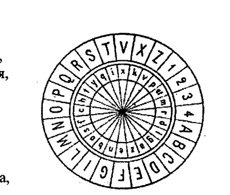
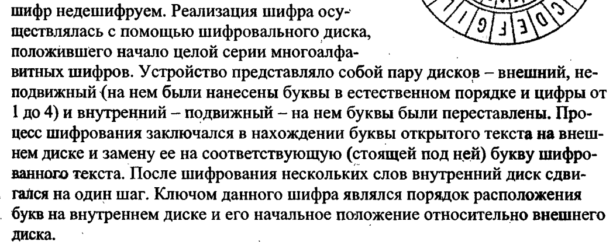

# Шифр простой замены
Шифр простой замены это $(\Sigma^*, \Sigma^*,S_{\Sigma},E,D)$

Где

* $S_{\Sigma}$-это группа перестановок на $\Sigma$

**Открытый текст** m = $m_1m_2...m_n$  
**Криптограмма** c = $с_1с_2...c_n$

$k \in S_{\Sigma}$ такое что $k:\Sigma\rightarrow \Sigma$ (эта стрелка обозначает биекцию, в латехе нет таких стрелок блять)

$\forall i \in \{1,...n\}: c_i=k(m_i)$

$\forall i \in \{1,...n\}: m_i=k^{-1}(c_i)$

# Исторические шифры простой замены

## Диск Альберти

## Шифр Цезаря
Если сопоставить каждому символу алфавита его порядковый номер (нумеруя с 0), то шифрование и дешифрование можно выразить формулами модульной арифметики[1][2]:

$y =(x+k) mod(n)$

$x=(y−k)mod(n)$

где 

* x—символ открытого текста, 
* y—символ шифрованного текста, 
* n—мощность алфавита, а 
* k—ключ.(Ключ это число, на которое сдвигаем букву)

## Шифр Виженера
Шифр виженера это $(\Sigma^*,\Sigma^*,\Sigma^*,E,D)$

**Открытый текст** m = $m_1m_2...m_n$  

**Криптограмма** c = $с_1с_2...c_n$  

**Ключ(какое-то слово)** k = $k_1,...k_p$, где $p \ll n$ (т.е длина ключа намного меньше длины открытого текста)

$c_i = (m_i + k_{[(i-1)\%p]+1})mod(|\Sigma|)$

$m_i = (c_i - k_{[(i-1)\%p]+1})mod(|\Sigma|)$

# Про криптоанализ

Находимся в условиях, когда криптоаналитик знает какую криптосистему мы используем, но он не знаетключ

### ОПР
**Атака** - Совокупность условий, в которых находится крипто аналитик называется атакой 

### Виды атак и методы атак

#### Виды атак:
1. **С известным шифротекстом**. Мы имеем доступ к зашифрованному сообщению и взлом осуществляется с помощью его исследования

2. **С известным открытым текстом**. Известны пары открытого текста и шифр текста

3. **С наиболее вероятным словом**, т.е знаем, что в криптограмме обязательно содержится определенное слово

4. **С избранным открытым текстом**, т.е Атакующий может расшифровывать выбранные шифртексты (кроме целевого). Либо атакующий может шифровать фрагменты открытого текста

#### Методы атак:

1. **Brute-force attack** (Полный перебор)
Суть: Перебор всех возможных ключей.
Эффективность: Зависит от длины ключа (например, 128-битный AES требует ~2¹²⁸ попыток).
Защита: Использование длинных ключей (256 бит и более).

2. **Частичная индукция**, т.е восстановление части открытого текста по криптограме

3. **Информационная индукция**, Получение некоторой инфы об открытом тексте по криптограме

# Криптоанализ шифра простой замены
### Атака №3(не устойчив к этой атаке)

Атакующий может зашифровать весь алфавит. После зашифровки мы получаем сразу весь ключ

### Атака №2 (Взлом стал труднее, но ещё возможен)

По паре $(m_i, c_i)$ находим часть ключевой перестановки, (смотрим как переходят буквы из открытго текста в криптограмму, таким образом получаем часть ключа). 
   
Затем частично расшифровываем целевую криптограмму, а затем пытаемся дополнять рассшифрованный текст по осмысленности(по другим свойствам языка)

### Атака №2'(Взлом стал труднее, но ещё возможен)

Метод протяжки слов, т.е подставляем в возможные места известные слова, получая фрагмент ключа. Если мы правильно подставили вероятные слова, то дальше подбираем ключ по осмысленности.

Пример от Ананичева:
Если есть Террористы, которые переписываются с шифром простой замены, то скорее всего они говорят слова "Бомба" или "Алах ак бар". Эти слова можно протягивать сквозь текст, получая ключ

### Атака №1

* **Частотный криптоанализ (подходит для длинных текстов > 3000 символов)**. 

  1. В зашифрованном тексте подсчитывают, какие символы встречаются чаще.

  2. Сравнивают с частотностью букв в языке (например, в русском чаще всего "О", "Е", "А").

  3. Подбирают замену, пока текст не станет осмысленным.  

Для некоторых текстов, частоты могут меняться, например перед тем как зашифровать текст, можно удалить из него все знаки препинания, пробелы. 

Также если текст - тематический, то наиболее вероятные слова могут сместить частоты.

**Нотесравил - гласные и согласные идут по убыванию частот. Гласные стоят раньше согласных**

**Частоты букв в русском языке**
<table class="standard">
<thead>
<tr>
<th>буква</th>
<th>ранг</th>
<th>употреблений</th>
<th>частотность</th>
<th>графика</th>
</tr>
</thead>
<tbody>
<tr>
<td align="center">а</td>
<td align="right">3</td>
<td align="right">40 487 008</td>
<td align="right">8,01%</td>
<td align="left">
&nbsp;
</td>
</tr>
<tr>
<td align="center">б</td>
<td align="right">21</td>
<td align="right">8 051 767</td>
<td align="right">1,59%</td>
<td align="left">
&nbsp;
</td>
</tr>
<tr>
<td align="center">в</td>
<td align="right">9</td>
<td align="right">22 930 719</td>
<td align="right">4,54%</td>
<td align="left">
&nbsp;
</td>
</tr>
<tr>
<td align="center">г</td>
<td align="right">19</td>
<td align="right">8 564 640</td>
<td align="right">1,70%</td>
<td align="left">
&nbsp;
</td>
</tr>
<tr>
<td align="center">д</td>
<td align="right">13</td>
<td align="right">15 052 118</td>
<td align="right">2,98%</td>
<td align="left">
&nbsp;
</td>
</tr>
<tr>
<td align="center">е</td>
<td align="right">2</td>
<td align="right">42 691 213</td>
<td align="right">8,45%</td>
<td align="left">
&nbsp;
</td>
</tr>
<tr>
<td align="center">ё</td>
<td align="right">33</td>
<td align="right">184 928</td>
<td align="right">0,04%</td>
<td align="left">
&nbsp;
</td>
</tr>
<tr>
<td align="center">ж</td>
<td align="right">25</td>
<td align="right">4 746 916</td>
<td align="right">0,94%</td>
<td align="left">
&nbsp;
</td>
</tr>
<tr>
<td align="center">з</td>
<td align="right">20</td>
<td align="right">8 329 904</td>
<td align="right">1,65%</td>
<td align="left">
&nbsp;
</td>
</tr>
<tr>
<td align="center">и</td>
<td align="right">4</td>
<td align="right">37 153 142</td>
<td align="right">7,35%</td>
<td align="left">
&nbsp;
</td>
</tr>
<tr>
<td align="center">й</td>
<td align="right">23</td>
<td align="right">6 106 262</td>
<td align="right">1,21%</td>
<td align="left">
&nbsp;
</td>
</tr>
<tr>
<td align="center">к</td>
<td align="right">11</td>
<td align="right">17 653 469</td>
<td align="right">3,49%</td>
<td align="left">
&nbsp;
</td>
</tr>
<tr>
<td align="center">л</td>
<td align="right">10</td>
<td align="right">22 230 174</td>
<td align="right">4,40%</td>
<td align="left">
&nbsp;
</td>
</tr>
<tr>
<td align="center">м</td>
<td align="right">12</td>
<td align="right">16 203 060</td>
<td align="right">3,21%</td>
<td align="left">
&nbsp;
</td>
</tr>
<tr>
<td align="center">н</td>
<td align="right">5</td>
<td align="right">33 838 881</td>
<td align="right">6,70%</td>
<td align="left">
&nbsp;
</td>
</tr>
<tr>
<td align="center">о</td>
<td align="right">1</td>
<td align="right">55 414 481</td>
<td align="right">10,97%</td>
<td align="left">
&nbsp;
</td>
</tr>
<tr>
<td align="center">п</td>
<td align="right">14</td>
<td align="right">14 201 572</td>
<td align="right">2,81%</td>
<td align="left">
&nbsp;
</td>
</tr>
<tr>
<td align="center">р</td>
<td align="right">8</td>
<td align="right">23 916 825</td>
<td align="right">4,73%</td>
<td align="left">
&nbsp;
</td>
</tr>
<tr>
<td align="center">с</td>
<td align="right">7</td>
<td align="right">27 627 040</td>
<td align="right">5,47%</td>
<td align="left">
&nbsp;
</td>
</tr>
<tr>
<td align="center">т</td>
<td align="right">6</td>
<td align="right">31 620 970</td>
<td align="right">6,26%</td>
<td align="left">
&nbsp;
</td>
</tr>
<tr>
<td align="center">у</td>
<td align="right">15</td>
<td align="right">13 245 712</td>
<td align="right">2,62%</td>
<td align="left">
&nbsp;
</td>
</tr>
<tr>
<td align="center">ф</td>
<td align="right">31</td>
<td align="right">1 335 747</td>
<td align="right">0,26%</td>
<td align="left">
&nbsp;
</td>
</tr>
<tr>
<td align="center">х</td>
<td align="right">24</td>
<td align="right">4 904 176</td>
<td align="right">0,97%</td>
<td align="left">
&nbsp;
</td>
</tr>
<tr>
<td align="center">ц</td>
<td align="right">28</td>
<td align="right">2 438 807</td>
<td align="right">0,48%</td>
<td align="left">
&nbsp;
</td>
</tr>
<tr>
<td align="center">ч</td>
<td align="right">22</td>
<td align="right">7 300 193</td>
<td align="right">1,44%</td>
<td align="left">
&nbsp;
</td>
</tr>
<tr>
<td align="center">ш</td>
<td align="right">26</td>
<td align="right">3 678 738</td>
<td align="right">0,73%</td>
<td align="left">
&nbsp;
</td>
</tr>
<tr>
<td align="center">щ</td>
<td align="right">29</td>
<td align="right">1 822 476</td>
<td align="right">0,36%</td>
<td align="left">
&nbsp;
</td>
</tr>
<tr>
<td align="center">ъ</td>
<td align="right">32</td>
<td align="right">185 452</td>
<td align="right">0,04%</td>
<td align="left">
&nbsp;
</td>
</tr>
<tr>
<td align="center">ы</td>
<td align="right">17</td>
<td align="right">9 595 941</td>
<td align="right">1,90%</td>
<td align="left">
&nbsp;
</td>
</tr>
<tr>
<td align="center">ь</td>
<td align="right">18</td>
<td align="right">8 784 613</td>
<td align="right">1,74%</td>
<td align="left">
&nbsp;
</td>
</tr>
<tr>
<td align="center">э</td>
<td align="right">30</td>
<td align="right">1 610 107</td>
<td align="right">0,32%</td>
<td align="left">
&nbsp;
</td>
</tr>
<tr>
<td align="center">ю</td>
<td align="right">27</td>
<td align="right">3 220 715</td>
<td align="right">0,64%</td>
<td align="left">
&nbsp;
</td>
</tr>
<tr>
<td align="center">я</td>
<td align="right">16</td>
<td align="right">10 139 085</td>
<td align="right">2,01%</td>
<td align="left">
&nbsp;
</td>
</tr>
</tbody>
</table>

**Если текст короткий, то:**
* Делаем много разных гиппотез о возможных соотвествиях букв открытого текста буквам из криптограммы 
  
* Чтобы сократить кол-во гиппотез, можно использовать частоты биграм, триграм и т.д сравнив их с их реальными частотами

* Также можно использовать информацию о паросочетаниях букв
  * ГГ - встречается с частотой 0.065
  * ГС - встречается с частотой 0.383
  * СГ - встречается с частотой 0.383
  * СС - встречается с частотой 0.168