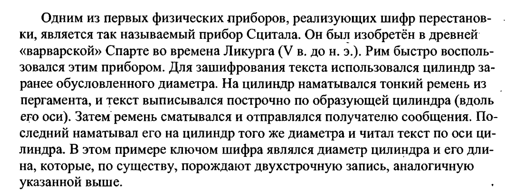
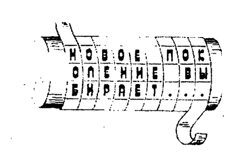
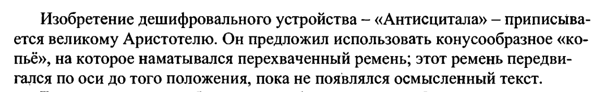
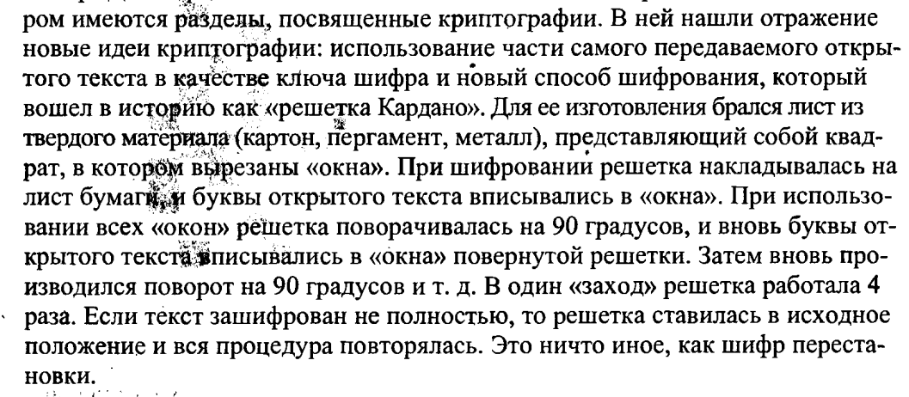
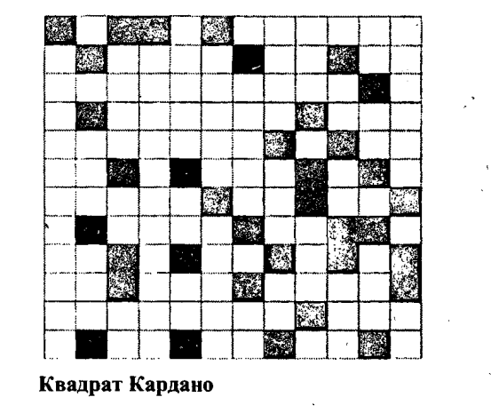

# Шифр перестановки
Шифр перестановки это 

$(\Sigma^n, \Sigma^n, S_n, E, D)$

Где:
  
* $S_n$ - это все перестановки длины n
 
**Открытый текст** m = $m_1m_2...m_n$

**Криптограмма** c = $c_1c_2...c_n$

$k \in S_n$ такое что $k:\{1,2...n\}\rightarrow \{1,2...n\}$(эта стрелка обозначает биекцию, в латехе нет таких стрелок блять)

$E(m,k)=c \ \text{по правилу } c_i=m_{k(i)} \text{где } j= k(i)$   

$D(c,k)=m \ \text{по правилу } m_i=c_{k^{-1}(i)} \text{где } i= k^{-1}(i)$

# Исторические шифры перестановки

## Шифр Сцитала

## Решетка Кардано

# Про криптоанализ

Находимся в условиях, когда криптоаналитик знает какую криптосистему мы используем, но он не знаетключ

### ОПР
**Атака** - Совокупность условий, в которых находится крипто аналитик называется атакой 

### Виды атак и методы атак

#### Виды атак:
1. **С известным шифротекстом**. Мы имеем доступ к зашифрованному сообщению и взлом осуществляется с помощью его исследования

2. **С известным открытым текстом**. Известны пары открытого текста и шифр текста

3. **С наиболее вероятным словом**, т.е знаем, что в криптограмме обязательно содержится определенное слово

4. **С избранным открытым текстом**, т.е Атакующий может расшифровывать выбранные шифртексты (кроме целевого). Либо атакующий может шифровать фрагменты открытого текста

#### Методы атак:

1. **Brute-force attack** (Полный перебор)
Суть: Перебор всех возможных ключей.
Эффективность: Зависит от длины ключа (например, 128-битный AES требует ~2¹²⁸ попыток).
Защита: Использование длинных ключей (256 бит и более).

2. **Частичная индукция**, т.е восстановление части открытого текста по криптограме

3. **Информационная индукция**, Получение некоторой инфы об открытом тексте по криптограме

# Криптоанализ шифра перестановки

### Атака№3(не устойчив к этой атаке)

можно по очереди зашифровать тексты вида:

* БААА...А  

* АБАА...А  

* ААБА...А  

* ...  

* АААА...Б  

глядя на эти тексты, мы узнаем куда перемещается буква Б, а также мы получим длину ключа,по образовавшимся периодам, таким образом получим ключ. Шифруем n раз, где n длина открытого текста 

Также можно зашифровывать 
тексты вида

* AA..AББ..Б (первая половина состоит из букв А, вторая из букв Б)

* AA..AБ..ББAA..AБ..ББ(первая четверть из букв А, вторая из букв Б, третья снова из букв А, 4ая из букв Б)

* и тд

В итоге получим log(n) строк, с разными столбиками. Выясним, куда шифр перемещает iый столбик, тем самым поймем, куда перемещается iая буква из открытого текста

### Атака №2(Взлом стал труднее, но ещё возможен)

По паре $(m_i, c_i)$ находим часть ключевой перестановки, т.е множество перестановок, которые могут быть ключами, таким образом сокращая кол-во возможных перестановок. А потом перебор либо дополнение по осмысленности 

### Атака № 2'(Взлом стал труднее, но ещё возможен)

Подбираем кусок, в котором получается известное слово. Шифр перестановки не меняет множество букв, он просто переставляет их. Находим множество букв, из которых состоит нужное слово и пробуем переставлять их так, чтобы они оказались вместе. Далее подбираем ключ по осмысленности

### Атака № 1 

Перебор длины ключа. Перебираем n, начиная с 2 и далее во возрастанию.

После того как нашли длину ключа n, можно разделить зашифрованный текст по строчкам длины n и начинаем переставлять столбики, чтобы читался текст.

Чтобы сократить перебор, можно не рассматривать запрещенные или биграммы.Например Ъь, когда й стоит в начале слова. После того как выписали все запрещенные биграммы, то можем запретить стоять определенным столбикам друг за другом, иначе эта биграмма появится.

Таким образом построим таблицу запретов. Заполнив эту таблицу мы существенно сократим перебор