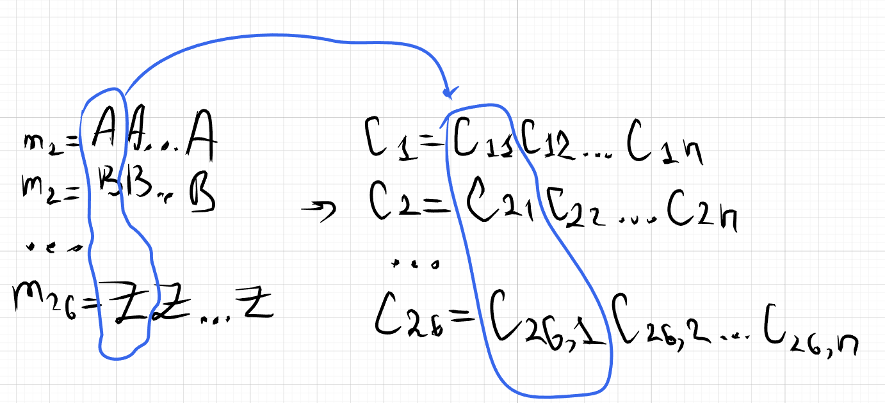
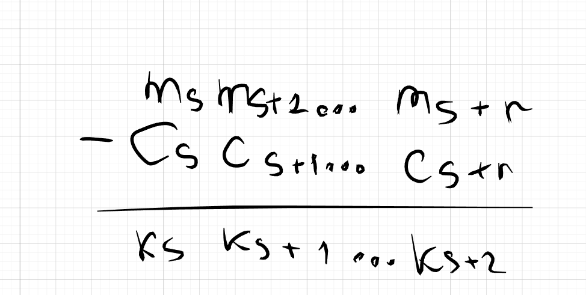
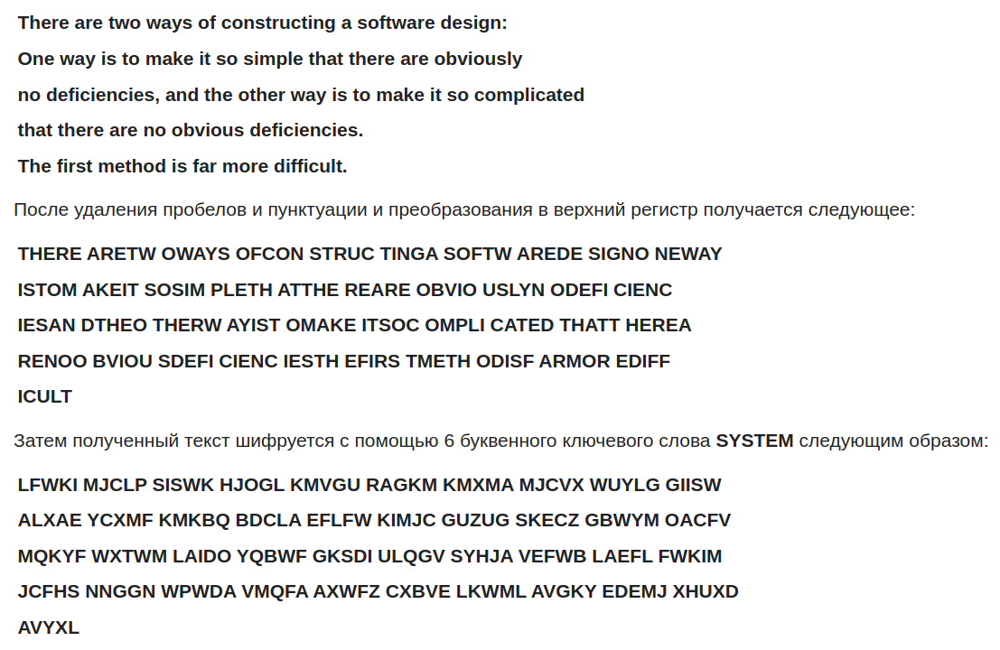
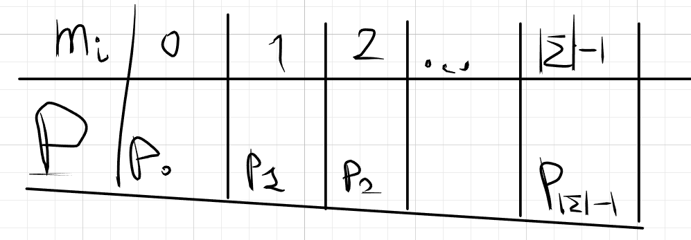
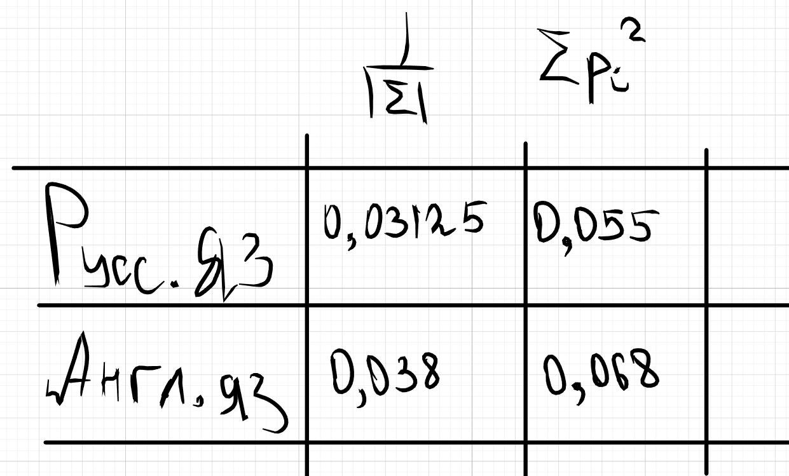

# Шифр Виженера
Шифр виженера это $(\Sigma^*,\Sigma^*,\Sigma^*,E,D)$

**Открытый текст** m = $m_1m_2...m_n$  

**Криптограмма** c = $с_1с_2...c_n$  

**Ключ(какое-то слово)** k = $k_1,...k_p$, где $p \ll n$ (т.е длина ключа p намного меньше длины открытого текста n)

**Ключ циклически распространяем на весь открытый текст**

$c_i = (m_i + k_{[(i-1)\%p]+1})mod(|\Sigma|)$

$m_i = (c_i - k_{[(i-1)\%p]+1})mod(|\Sigma|)$

# Криптоанализ шифра Виженера

### Атака №3(классический вариант, когда буквы расположены в алфавитном порядке, А-0ая, Б-1ая и тд)

Шифруем длинную строку из букв A. Полученная криптограмма будет представлять собой строку вида ключключключ, т.к у буквы A - номер 0 в алафите

### Атака №3(некласический вариант, не можем пронумеровать буквы, т.к не знаем их порядок)

По очереди шифруем длинные строки вида:

* $m_1$ = AAA..A
* $m_2$ = BBB..B
* и тд
* $m_26$ = ZZZ..Z

получив строчки $c_1, c_2, c_3$ и тд $c_{26}$. Записываем эти строчки друг под другом. Таким образом мы знаем как действует iый символ ключа на iый столбик открытого текста

### Атака № 2(класический вариант)

Есть пара

$m_1 = m_{1,1}m_{1,2}...m_{1,t}$  
$c_1 = c_{1,1}c_{1,2}...c_{1,t}$
  
$m_2 = m_{2,1}m_{2,2}...m_{2,t}$  
$c_2 = c_{2,1}c_{2,2}...c_{2,t}$

и тд

Чтобы найти ключ можно посчитать разность, т.к 
$$k_i=(c_i-m_i)mod(|\Sigma|)$$ 

**Т.е в теории достаточно даже одной пары**

### Атака № 2(некласический вариант)

Используя пары узнаем, куда iый символ ключа переводит iый cимвол открытого текста. Узнаем значительную часть ключа, а дальше перебор. 

# Вопрос как понять где начинается ключ, и его длину, ведь в общем случае пары могут быть зашифрованы разными фрагментами ключа

### Атака №2'

**Метод протяжки вероятного слова**, подставляем слово в наиболее вероятную часть шифр-текста, а дальше вычисляем разность таким образом находим часть ключа

Если это слово ключевое, то начинаем сдвигать его вправа и пробовать расшифровать шифр текст

### Атака № 1

Необходимо найти длину ключа.

# Поиск длины ключа

## Метод Казиски

Наиболее вероятная причина появления в шифр тексте длинных повторяющихся частей это шифрование одинаковых частей открытого текста одинаковыми частями ключа. 

**Идея метода** основана на том, что ключи являются периодическими, а в естественном языке существуют часто встречающиеся буквосочетания: биграммы и триграммы. Это наводит на мысль, что повторяющиеся наборы символов в шифротексте — повторения популярных биграмм и триграмм исходного текста.

Метод Касиски заключается в поиске групп символов, которые повторяются в зашифрованном тексте. **Группы должны состоять из не менее чем трех символов**. Тогда расстояния между последовательными возникновениями групп, вероятно, будут кратны длине ключевого слова. **Предполагаемая длина ключевого слова кратна наибольшему общему делителю всех расстояний.**

**Причина, по которой метод работает — это то, что если две группы символов повторяются в исходном тексте и расстояние между ними является кратным длине ключевого слова, то буквы ключевого слова выровняются с обеими группами.**

Пример

## Подсчёт числа совпадений
### ОПР
Пусть $\Sigma$ - некоторый конечный алфавит. Тогда **индексом совпадения** для слова $w=w_1w_2...w_n$ называют
$$IC(w) = \Sigma_{i=1}^{|\Sigma|} \frac{F_i(F_n-1)}{n(n-1)}$$

Где: 

* $F_i$ - это частота встречаемости буквы $w_i$ в w

**Если по-простому то индекс совпадений это доля пар совпадающих букв**

Пример

* IC(математика) = $\frac{3+1+1}{C_{10}^2} = \frac{1}{9}$

## Применяем теорему из 4 билета **об индексе совпадений в криптограмме, защифрованной шифром Виженера**

Для шифра виженера мы выбираем такое $U \subseteq \mathcal{K}$ что : 
* $i\sim j \Longleftrightarrow p | (j-i)$ т.е отношение волна связывает все пары букв на расстоянии кратном длине ключа

Пусть для простоты p|n, т.е n = $p\cdot k$

Отношение $\sim$ разбивает множество {1,2,...n} на p классов, в каждом из которых по k элементов

т.е разбиение $\sim$ = {  
    {1, p+1, 2p+1, ...},  
    {2, p+2, 2p+2, ...},  
    ...
    {p, 2p, 3p, ...}  
}  
**буквы в одном классе шифруются одной и той же буквой ключа**

$\measuredangle$ $|\sim| \backslash n$ = $p\cdot k \cdot(k-1)$ =  
где

* p - кол-во классов 
* k - кол-во элементов в классе
* k-1 - кол-во пар в одном классе 

Тогда $\bar{|\sim|}$ = $n(n-1)-pk(k-1)$ = 

* Преобразуем выражения, сделав замену $[k=\frac{n}{p}]$

* $|\sim| \backslash n$ = $p\cdot \frac{n}{p} \cdot(\frac{n}{p}-1)$ = $\frac{n(n-p)}{p}$

* $\bar{|\sim|}$ = $n(n-1)- \frac{n(n-p)}{p}$ = $\frac{n^3(p-1)}{p}$

$\bigotimes$ можем преобразовать ф-лу из теоремы $\bigotimes$
  
$|\sim| \backslash n \cdot \frac{1}{n(n-1)}\cdot \Sigma_{i \in \Sigma}p_i^2$ + $\bar{|{\sim}|}\cdot \frac{1}{n(n-1)}\cdot \frac{1}{\Sigma}$ =

$\frac{n-p}{p(n-1)}\cdot\Sigma_{i\in\Sigma}p_i^2$ + $\frac{n(p-1)}{p(n-1)}\cdot\frac{1}{|\Sigma|}$

## Замечание о $\Sigma_{i=0}^{l-1} p_i$

Таблица распределения букв открытого текста

**Тогда $\Sigma_{i=0}^{|\Sigma|-1}p_i = 1$ т.к таблица распределения**

$\frac{1}{|\Sigma|} = \Sigma_{i=0}^{|\Sigma-1|}\lgroup\frac{1}{|\Sigma|}\rgroup^2$

- это сумма квадратов для равномерного распределения

$\frac{1}{|\Sigma|} < \Sigma_{s \in \Sigma}P(M=s)^2$
# Попроси рассказать про геометрическую интерпритацию ещё раз

## 1ый метод Фридмана
* работает только для малых p не более 5

Пусть C - это шифртекст. 

1. Вычисляем IC(c) 

2. Составляем таблицу из 

$$\frac{n-p}{p(n-1)} \Sigma_{i\in \Sigma}p_i^2 + \frac{n(n-1)}{p(n-1)}\cdot \frac{1}{|\Sigma|}$$

для разных p

3. Сравниваем IC(c) и суммы из таблицы

## 2ой метод Фридмана

Строим для каждого d($d\in \{2,3,..p\}$) разбиение криптограммы на подмножества:
* $C^1 = \{c_1, c_{d+1}, c_{2d+1}, ...\}$
* $C^2 = \{c_2, c_{d+2}, c_{2d+2}, ...\}$
* и тд
* $C^d = \{c_d, c_{2d}, c_{3d}, ...\}$

если p|d, то $IС(C^1)=\Sigma p_i^2$,
* т.к буквы в разбиении шифруются одним и тем же символом ключа 

если $p\nmid d$, то $IС(C^1)=\Sigma p_i^2$ находится между $\frac{1}{|\Sigma|}$ и $\Sigma p_i^2$

**Можно вычислить $IC(С^i) \ \forall i \in \{1,2,3...d\}$, а потом вычислить среднее, чтобы получить более точный результат** 

Постепенно увеличивая d и считая IC(С), мы должны заметить скачок IC(C) до табличного значения $\Sigma p_i^2$ для выбранного языка. Это признак того, что мы добрались до истинной длины ключа

для русского языка (е = ё)

* Эта штука всегда работает

После того как мы нашли длину ключа, то в каждой из последовательностей

* $C^1 = \{c_1, c_{d+1}, c_{2d+1}, ...\}$
* $C^2 = \{c_2, c_{d+2}, c_{2d+2}, ...\}$
* и тд
* $C^d = \{c_d, c_{2d}, c_{3d}, ...\}$

необходимо провести частотный анализ, т.к по существу каждая из них зашифрована шифром цезаря. 

После частотного анализа мы узнаем чему равна iая буква ключа

# **Посмотри как ломать Виженера, зная длину ключа**