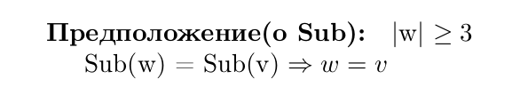

## Опр(централизатор)
$Z(\rho) = \{e: \mathcal{M} >\twoheadrightarrow \mathcal{M}| \rho \circ e = e\circ \rho\}$ - централизатор $\rho$

## ОПР (Множество sub)

$w \in \Sigma^{*}$, то $sub(w) = \{v \in \Sigma^{*}| w\ \rho \ v\} \backslash {w}$

## ОПР (Содержание слова)

**Содержание слова $w \in \Sigma^{*}$** это $S(w) = \{a \in \Sigma| |w|_a > 0\}$

# Предложение(Главная часть билета)

**Почему важно, что $|w| \ge 3$**

* $sub(ab) = \{a,b\} = sub(ba), ab\neq ba$

## Д-ВО

**Сначала разберём случай, когда $|w| = 3$**

в таком случае можно разделить все слова на 3 кучки по размеру содержания

**|S(w)| = 1**

Тогда S(w) = {a}, $w = a^3$, $sub(a^3) = \{a^2\}$

* у если $sub(v) = \{a^2\}$, то $S(v)=\{a\}, |v| = 3 \Rightarrow v = a^3 = w$

**|S(w)| = 2, т.е $S(w) = \{a,b\}$**

пусть: $|w|_a = 2, |w|_b=1$ 

тогда $w = \begin{cases}
    a^2b \\
    aba \\
    ba^2
\end{cases} \ \Rightarrow \ sub(w)=\begin{cases}
    \{a^2, ab\} \\
    \{a^2, ab, ba\} \\
    \{a^2, ba\}
\end{cases}$

если $sub(v) \in \{\{a^2, ab\}, \{a^2, ab, ba\}, \{a^2, ba\}\} \Rightarrow$

$S(v) = \{a,b\}, |v|_a=2, |v|_b = 1$ т.е $v \in {a^2b, aba, ba^2}$

* У всех слов разные сабы, что значит, что sub(v) однозначно определяет v

**|S(w)| = 3, т.е $S(w) = \{a,b,c\}$**

т.е w - анаграмма abc

$sub(abc) = \{ab, ac, bc\}$ 

Б.О.О $sub(v) = \{xy,xz,yz\} \Rightarrow S(v) = \{x,y,z\}, |v|=3$, т.е v - тоже анаграма xyz

**sub(v) задаёт порядок следования:**

* x стоит раньше y и z

* y стоит раьньше z

$\Rightarrow sub(v)$ - однозначно задаёт слово v

Если $|w| \ge 4, |S(w)|>1$

w - может начинаться с 2 одинаковых букв, либо не начинается

**1. Б.О.О $w =a^2 w'$**

$sub(w) = \{aw', \{a^2x|w' \rho \ x\}\}$

если $sub(v) = \{aw', \{a^2x|w' \rho \ x\}\} \Rightarrow v = a^2w'$

* $aw'$ - слово с наименьшим числом букв a в начале среди sub(v)

* у слов вида $\{a^2x|w' \rho \ x\}$ букв a в начале больше на 1

* по словам вида $\{a^2x|w' \rho \ x\}$, сможем однозначно найти слово $aw'$, по которому легко востанавливается v(просто в начало a приписываем) $\Rightarrow$ v=w

**Получается, что по sub(v) можем однозначно восстановить v**

**1. Б.О.О $w =abw' ;|sub(w)|\ge 2$**

Если $|sub(w)| > 2$,

* то в $sub(w) \ \exist !$ слово, начинающиеся на b - cлово bw'. Все остальные слова начинаются на а. 

* Т.к $|sub(w)| > 2$, то слов, начинающихся на а, больше одного

* глядя на их кол-во слов, начинающихся с a узнаём какая первая буква. Глядя на слово bw' узнаём все остальные буквы

**Получается, что однозначно восстанавливаем v**

Если $|sub(w)| = 2 \Rightarrow sub(w)= \{bw', aw'\} \Rightarrow w' = b^{|w|-2}$
  
  * Если бы была третья буква, то могли бы её вычеркнуть, и получили бы новое слово
  
  * Если бы в w' была бы а, то могли бы её вычеркнуть и получить
    
    * если w' = uav($u,v \in \Sigma^k$), то $abuv \in sub(w)$: $abuv \neq buav$(очевидно) и $abuv \neq auav$, иначе бы получили, что bu = ua, причем у нас только буквы a и b. 
    
    * т.е bu'=bu'a и тд по индукции получаем, что $u = b^{k-1}$, но тогда $b^k \neq b^{k-1}a$ $\bigotimes$ 

получаем, что $|w| = b^{|w|-2}$

$sub(w) = \{b^{|w|-1}, ab^{|w|-2}\}$

**sub однозначно задаёт слово v = $ab^{|w|-1}$**

Если $|S(w)| = 1, |w| \ge 4$

тогда $sub(w)=\{a^{|w|-1}\}$

**однозначно восстанавливаем v = $a^{|w|}$**

$\blacksquare$