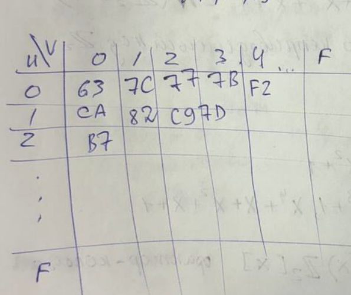

# Немного про блочные шифры

## ОПР(Блочный шифр)

Блочный шифр это криптосистема $(\{0,1\}^n, \{0,1\}^k, \{0,1\}^n, E,D)$
где: 
* $\mathcal{M} = \{0,1\}^n$
* $\mathcal{K} = \{0,1\}^k$
* $\mathcal{C} = \{0,1\}^n$
* n - длина блока
* k - длина ключа

Идея применять к маленьким кусочкам открытого текста сложные функции(которые нужно задать таблицей)

Затем перемешаем эти блоки(например с помощью линейного преобразования либо другая простая функция). Действуем этой функцией на весь большой блок открытого текста

## Итеративная схема блочного шифра

Есть 
* $f:\{0,1\}^n >\twoheadrightarrow \{0,1\}^n$ - сложное, локальное преобразование

* $g:\{0,1\}^n >\twoheadrightarrow \{0,1\}^n$ - простое, глобальное преобразование

* $h:\{0,1\}^n \times \{0,1\}^n \to \{0,1\}^n$ берёт че-то и ключ и возращает че-то другое

* **$h_k = h(\_,k)$ т.е в преобразование закладываем ключ k**
  
По итогу получаем формулу для криптограммы

$$
    c = (h_k \circ f \circ g) ^r (m)
$$

* r - это число раундов

## Конструкция фейстеля

Открытый текст разобъем его на 2 части(n - длина открытого текста - четное число)

$m = L_0R_0$, где:
* $L_0, R_0 \in \{0,1\}^{\frac{n}{2}}$

теперь преобразовываем эти полублоки

$\forall i = \{1, \cdots, r\}:$
* $L_i = R_{i-1}$
* $R_i = L_{i-1} \bigoplus f(R_{i-1},k_i)$
  * $k_i$ - раундовый ключ, как-то получается из основного ключа 

Проделываем процедуру и в конце получаем $L_r, R_r$. 

Формула для криптограмы c:
$$
c = R_rL_r
$$

## Как расшифровывать криптограмму c? 

пусть $c = u_0v_0$

$\forall i \in \{1, \cdots, r\}$
* $u_i = v_{i-1}$
* $v_i=u_{i-1} \bigoplus f(v_{i-1}, k_{r+1-i})$

Проделываем процедуру и получаем $v_r, u_r$ 

Тогда формула для открытого текста это 

$$
m = v_ru_r
$$

### Д-ВО
С помощью индукции по i нужно показать, что:
* $u_i = R_{r-i}$
* $v_i = L{r-i}$

**Б.И**

$i=0: \begin{cases}
    u_0 = R_r \\
    v_0 = L_r
\end{cases}$

**Ш.И от $(i-1) \to i$**
* по опр конструкции Фейстеля $L_i = R_{i-1}$
  
$u_i = v_{i-1}$ = [П.И] = $L_{r-i+1} = R_{r-i}$

$v_i = u_{i-1} \bigoplus f(v_{i-1}, k_{r+1-i})$
* **по П.И:**
  * $u_{i-1} = R_{r-i+1} =$
  * $v_{i-1} = L_{r-i+1} = R_{r-i}$
  * подставим

$v_i = R_{i-i+1} \bigoplus f(R_{r-i}, k_{r+1-i})$

из $R_i = L_{i-1} \bigoplus f(R_{i-1},k_i) \Rightarrow$

$L_{i-1} = R_i \bigoplus f(R_{i-1}, k_i) \Rightarrow$ 

По итогу получаем, что

$L_{r-i} = R_{r-i+1} + (R_{r-i},k_{r-i+1})$

$\blacksquare$

Конструкция расшифрования такая же как и шифрования, кроме порядка ключей

* **При шифровании ключи используются по возрастанию**
* **При расшифровании ключи используются по убыванию**

Нам не важно какую функцию f использовать, т.к не имеет значение её обратимость $\to$ **можем выбрать сколь угодно сложную функцию**

# AES (Advanced Encryption Standard)

* Блок 128 бит
* Ключ 128, 192, 256 бит

$M_b = 4$ - длина блока в машинных словах, где одно слово это 32 бита

$N_k = 4,6,8$ - длика ключа в машинных словах

$N_r = N_k + 6$ - число раундов

* **Структура "квадрат"**

$State \in (\{0,1\}^8)^{4\times 4}$

* текущее состояние обрабатываемого блока открытого текста это квадрат $4 \times 4$ байт
  
* в начале помещаем в state открытый текст

State = m

происходит обработка

c = State

Помещать и извлекать нужно по столбикам

$m = m_0m_1\cdots m_{15}$ разбили открытый текст на 16 кусочков размером с байт. Текст размещается по столбикам, как показано на картинке

# Функции
$SB$ - функция замены байт

$SB: \{0,1\}^8 >\twoheadrightarrow \{0,1\}^8$

Байт - триедин:
* Это битовая цепочка $\{0,1\}^8$
* это число от 0 до 255
* байт это элемент 256 элементного поля $GF(256) = F$

чтобы построить $GF(256)$ используют неприводимый многочлен:

$f(x) = x^8 + x^4 + x^3 + x + 1$

Убедимся, что он неприводимый, т.е $\in N(\mathbb{Z}_2[x])$

все неприводимые над $\mathbb{Z}_2$ до 4 степени:

* $x$ т.к нет корней, то не делитель

* $x+1$ т.к нет корней, то не делитель

* $x^2+x+1$ не делитель, т.к он делит только $x^4 + x^3 + x + 1$. 

* $x^3 + x +1$ не делитель.  $x^4 + x^8 = x^4(1 + x^4)$- здесь нет делителей

* $x^3 + x^2 +1$ не делитель. $x^8 + 1 = (x+1)^8$ по биномиальной теореме

* $x^4 + x +1$ не делитель.$x^8 + x^3 = x^3(x^5 + 1) = x^3(x+1)(x^4 + x^3 + x^2+ x + 1)$

* $x^4 + x^3 +1$ не делитель. $x^8 + x = x(x^7+1)=x(x+1)(x^6 + x^5 + x^4 + x^3 + x^2 + x + 1)$ = $x(x+1)(x^3 + x^2 +1) \cdot (x^3 + x +1)$

* $x^4 + x^3 + x^2 + x + 1$ - не делитель. $x^8 + x^2 = x^2(x^6+1)=x^2(x^3+1)^2$

т.е $F = \mathbb{Z}_2[x]_{/f(x)\mathbb{Z}_2[x]}$ - фактор кольцо

* Каждый элемент этого поля - 8 битовая цепочка
* Каждая цепочка понимается как многочлен
* Т.е складывать и умножать их надо как многочлены - сложил/умножил, затем взял остато от деления на f(x)
  
**Идеал** - множество всех многочленов, замкнутых относительно сложения и умножения на любой элемент.

Сложение это обычный $\bigoplus$

Умножение - особенное

## Функция SB

$SB(h) =(x^4 + x^3 + x^2+x+1) \cdot h^{-1} \bigoplus (x^6 + x^5 + x + 1) \ (mod(x^8 + 1))$

* **$h^{-1}$ - это обращение в поле F**, т.е обращение делаем с помощью такого многочлена $f(x) = x^8 + x^4 + x^3 + x + 1$
* по договоренности $0^{-1} = 0$
* умножение многочленов обычное, но берем остаток от $x^8 + 1$

**Сделаем препроцессинг:**

Каждому многочлену $h \leftrightarrow u||v$
* $u,v \in \{0,1,\cdots,E, F\}$ - 16 ричные цифры

$SB(h) \leftrightarrow a b$
* $a,b \in \{0,1, \cdots, E,F\}$ - 16 ричные цифры

для более удобного вычисления SB(h) заполняют специальную таблицу по типу такой

## Функция ISB
# Попроси ещё раз её вывести
$ISB = SB^{-1}$

если $p = SB(h)$, то $h = ISB(p)=$

$(x^4 + x^3 + x^2+x+1)$ - неприводим над $\mathbb{Z}_2$

$(x^8 +1) = (x+1)^8$

$\Rightarrow (x^8+1) и (x^4 + x^3 + x^2+x+1)$ - взаимо просты, ищем обратный по расширенному алгоритму евклида

нашли это $x^6 + x^3 + x$

$f = ISB(h) =((x^6 + x^3+x)\cdot h + (x^2+1)Mod(x^8+1))^{-1}$

* Для удобства $ISB(X||Y)$ можно задать табличкой
* X и Y это тоже 16ричные цифры

* SB - сложное преобразование
* из SB можно изготовить функцию SubBytes(State)

$State = \begin{pmatrix}
S_{0,0}\ S_{0,1}\ S_{0,2}\ S_{0,3}\ \\
S_{1,0}\ S_{1,1}\ S_{1,2}\ S_{1,3}\ \\ 
S_{2,0}\ S_{2,1}\ S_{2,2}\ S_{3,3}\ \\
S_{3,0}\ S_{3,1}\ S_{3,2}\ S_{3,3}\ \\
\end{pmatrix}$

$SubBytes(State) = \begin{pmatrix}
SB(S_{0,0}) \cdots SB(S_{0,3}) \\
SB(S_{1,0}) \cdots SB(S_{1,3}) \\ 
SB(S_{2,0}) \cdots SB(S_{3,3}) \\
SB(S_{3,0}) \cdots SB(S_{3,3}) \\
\end{pmatrix}$

* из ISB можно изготовить аналогичную функцию InvSubBytes(State)

$InvSubBytes(State) = \begin{pmatrix}
ISB(S_{0,0}) \cdots ISB(S_{0,3}) \\
ISB(S_{1,0}) \cdots ISB(S_{1,3}) \\ 
ISB(S_{2,0}) \cdots ISB(S_{3,3}) \\
ISB(S_{3,0}) \cdots ISB(S_{3,3}) \\
\end{pmatrix}$

## Функция ShiftRows(State)
* Сдвигает строки таим образом, чтобы диагональ стала первым столбиком
  
$ShiftRows(State) = \begin{pmatrix}
S_{0,0}\ S_{0,1}\ S_{0,2}\ S_{0,3}\ \\
S_{1,1}\ S_{1,2}\ S_{1,3}\ S_{1,0}\ \\ 
S_{2,2}\ S_{2,3}\ S_{2,0}\ S_{2,1}\ \\
S_{3,3}\ S_{3,0}\ S_{3,1}\ S_{3,2}\ \\  
\end{pmatrix}$

* эта функция обратима, т.е можно ввести InvShiftRows =
* InvShiftRows применяет к строкам циклический сдвиг вправо на 0, 1, 2, 3 байта соответственно:

## Функция MixColumns(State)

$MixColumns(State) = A \cdot State$
где
* $A = \begin{pmatrix}
  02\ 03\  01\ 01 \\
  01\ 02\  03\ 01 \\
  01\ 01\  02\ 03 \\
  03\ 01\  01\ 02 \\
\end{pmatrix}$
* умножение в кольце матриц $F^{4 \times 4}$
* F - основное поле F = GF(256)
* эта функция обратима, для этого нужно показать, что A - обратимая матрица

$\measuredangle B = \begin{pmatrix}
0E\ & 0B\ & 0D\ & 09\\
09\ & OE\ & OB\ & OD\\
0D\ & 09\ & OE\ & OB\\
OB\ & OD\ & O9\ & OE\\
\end{pmatrix}$

$\measuredangle A \times B$
* рассмотрим, только первую строку, т.к строки этой матрицы получены циклическим сдвигом влево
  
$\measuredangle 02 \cdot  0E + 03\cdot09 + 01\cdot0D + 01\cdot0B = 01$

$\measuredangle 02 \cdot  0B + 03\cdot0E + 01\cdot09 + 01\cdot0D = 00$

$\measuredangle 02 \cdot  0D + 03\cdot0B + 01\cdot0E + 01\cdot09 = 00$

$\measuredangle 02 \cdot  09 + 03\cdot0D + 01\cdot0B + 01\cdot0E = 00$

$\Rightarrow InvMixColumns(State) = B\cdot State$
* умножение в кольце $F^{4\times4}$

# Шифрование

**Вход:**
* массив State,
* $w[0,(N_r+1)\cdot N_b-1]$
  * элементы этого массива это 32 битные машинные слова.
  * $\forall w_i \in \{0,1\}^{32}$

* $\vec{x_0}, \vec{x_1},\vec{x_2},\vec{x_3}$ - 4 32битовых слова(4 байтных)

$AddRoundKey(State, \vec{x_0}, \vec{x_1},\vec{x_2},\vec{x_3}) = \begin{pmatrix}
  S_{0,0} \bigoplus \vec{x_0}[0] & \cdots &S_{0,3} \bigoplus \vec{x_3}[0] \\
  S_{1,0} \bigoplus \vec{x_0}[0] & \cdots & S_{1,3} \bigoplus \vec{x_3}[0] \\
  S_{2,0} \bigoplus \vec{x_0}[0] & \cdots & S_{2,3} \bigoplus \vec{x_3}[0] \\
  S_{3,0} \bigoplus \vec{x_0}[0] &\cdots & S_{3,3} \bigoplus \vec{x_3}[0] \\
\end{pmatrix}$

* В начале в State помещаем открытый текст
State = m

$AddRoundKey(State, w[0, \cdots, N_0-1])$

> For Round = 1; Step = 1 To $N_{r-1}$:  

>> $SubBytes(State)$

>> $ShiftRows(State)$

>> $MixColumns(State)$

>> $AddRoundKey$(State, w[Round $\cdot N_b$, Round $\cdot N_b + N_b-1$])

> EndFor

> $SubBytes(State)$

> $ShitRows(State)$

> AddRoundKey(State, w[$N_r \cdot N_b, \cdots, (N_r+1)\cdot N_b - 1$])

> c = State # шифрование окончено

# Расшифровка

Это обратные функции в обратном поряке, ключи в обратном порядке

* функция AddRoundKey - имеет обратную, т.к это просто xor

* Можно применять обратные функции в том же порядке, что и прямые, но ключи в обратном порядке

# Алгоритм построения ключа(Key schedule)

**Вход**
* ключ $Key \in \{0,1\}^{128 \ либо\ 192\ либо \ 256}$
* $Key[0,1,\cdots N_{k-1}]$
  * $Key[i]\in {0,1}^{32}$_
  * массив 32 битовых слов длины $N_k$

> I = 0

> #инициализация
> WHILE(i < $N_k$):
> > w[I] = Key[I]
>
> > I += 1
> 
> End WHILE
>
> #обработка
> 
> WHILE(I < $N_b \cdot (N_{r+1})$):
> 
> > TEMP = w[i-1]
> 
> >IF(I mod $N_k$ == 0):
> > > TEMP = ($Subword$($Rotword$(TEMP))) xor $R_{con}[\frac{I}{N_k}]$
>>
> > else IF($N_k == 8$ AND $I \ mod \ N_K == 4$):
> >
> > > TEMP = $Subword$(TEMP)
> >
> > END IF 
> >
> > $w[i] = w[I - N_k] \ xor \ TEMP$
>
> End WHILE

* $Subword: \{0,1\}^{32} >\twoheadrightarrow \{0,1\}^{32}$
  * $Subword(a_0,a_1,a_2,a_3) = (SB(a_0),SB(a_1),SB(a_2),SB(a_3))$

* $Rotword: \{0,1\}^{32} >\twoheadrightarrow \{0,1\}^{32}$
  * $Rotword(a_0,a_1,a_2,a_3) = (a_1, a_2, a_3, a_0)$

* $R_{con}[t] \in\{0,1\}^{32}$
  *  $R_{con}[t] = 0x\backslash rc_i \ 0x\backslash00\  0x\backslash00\ 0x\backslash00$
  *  таблица значений для $rc_i$
  * 

# Достоинства
1. AES быстро шифрует,т.к мало раундов, также большая длина блока, т.е быстрее обрабатывает открытый текст

2. Переменная длина ключа

3. Нет битовых операций. Кроме SB, а также умножения в поле F (всё это можно задать с помощью таблицы)

# Недостатки
1. Могут быть секреты АМБ
2. Слишком молодой и не достаточно исследован