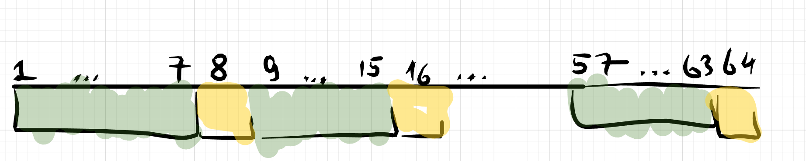
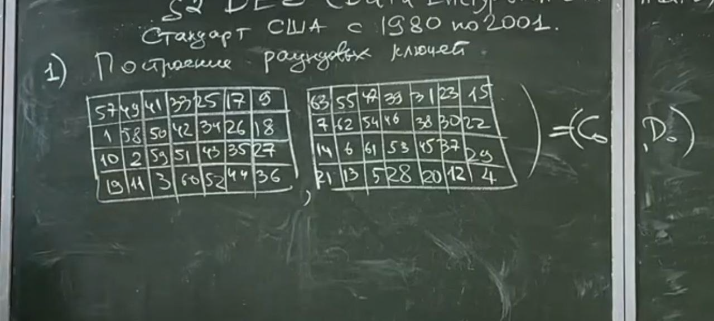
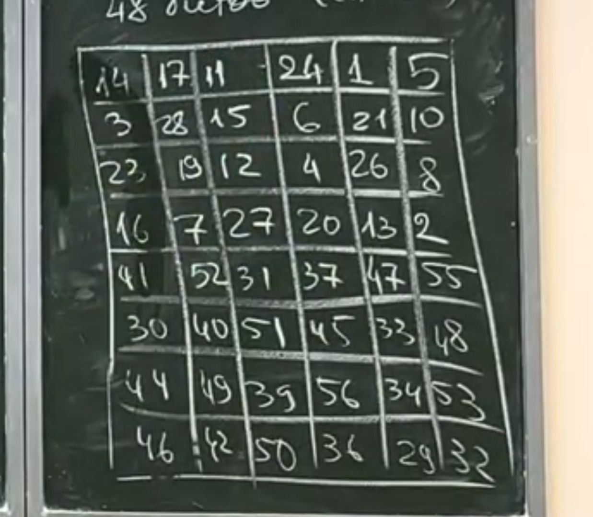
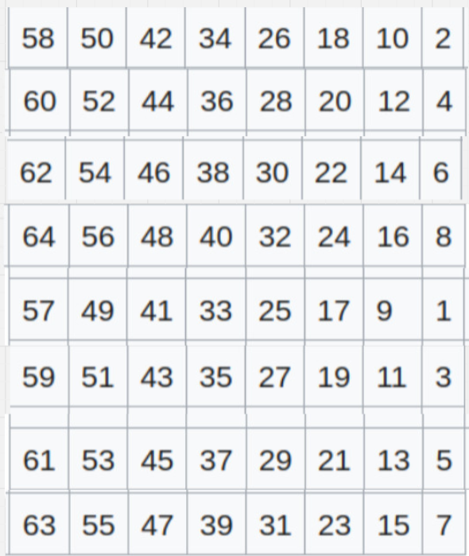
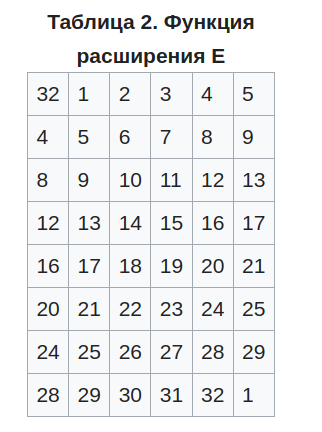
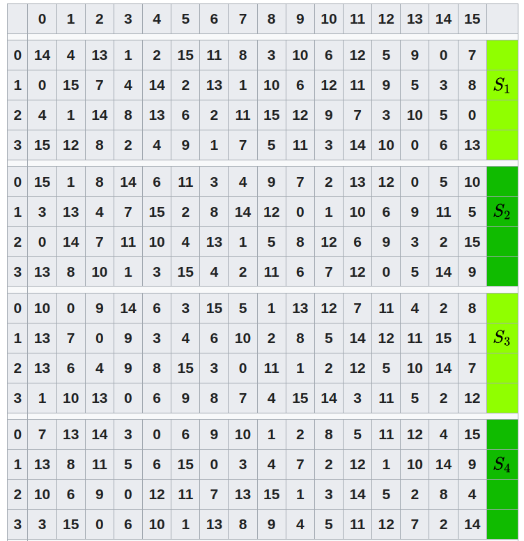
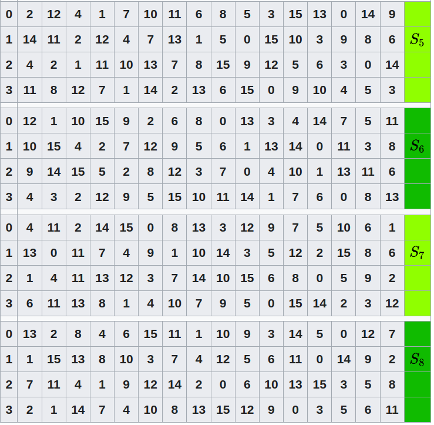
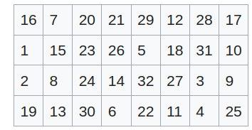

# Немного про блочные шифры

## ОПР(Блочный шифр)

Блочный шифр это криптосистема $(\{0,1\}^n, \{0,1\}^k, \{0,1\}^n, E,D)$
где: 

* $\mathcal{M} = \{0,1\}^n$

* $\mathcal{K} = \{0,1\}^k$

* $\mathcal{C} = \{0,1\}^n$

* n - длина блока

* k - длина ключа

Идея применять к маленьким кусочкам открытого текста сложные функции(которые нужно задать таблицей)

Затем перемешаем эти блоки(например с помощью линейного преобразования либо другая простая функция). Действуем этой функцией на весь большой блок открытого текста

## Итеративная схема блочного шифра

Есть 

* $f:\{0,1\}^n >\twoheadrightarrow \{0,1\}^n$ - сложное, локальное преобразование

* $g:\{0,1\}^n >\twoheadrightarrow \{0,1\}^n$ - простое, глобальное преобразование

* $h:\{0,1\}^n \times \{0,1\}^n \to \{0,1\}^n$ берёт че-то и ключ и возращает че-то другое

* **$h_k = h(\_,k)$ т.е в преобразование закладываем ключ k**
  
По итогу получаем формулу для криптограммы

$$
    c = (h_k \circ f \circ g) ^r (m)
$$

* r - это число раундов

## Конструкция фейстеля

Открытый текст разобъем его на 2 части(n - длина открытого текста - четное число)

$m = L_0R_0$, где:

* $L_0, R_0 \in \{0,1\}^{\frac{n}{2}}$

теперь преобразовываем эти полублоки

$\forall i = \{1, \cdots, r\}:$

* $L_i = R_{i-1}$

* $R_i = L_{i-1} \bigoplus f(R_{i-1},k_i)$

  * $k_i$ - раундовый ключ, как-то получается из основного ключа 

Проделываем процедуру и в конце получаем $L_r, R_r$. 

Формула для криптограмы c:

$$
c = R_rL_r
$$

## Как расшифровывать криптограмму c? 

пусть $c = u_0v_0$

$\forall i \in \{1, \cdots, r\}$

* $u_i = v_{i-1}$

* $v_i=u_{i-1} \bigoplus f(v_{i-1}, k_{r+1-i})$

Проделываем процедуру и получаем $v_r, u_r$ 

Тогда формула для открытого текста это 

$$
m = v_ru_r
$$

### Д-ВО

С помощью индукции по i нужно показать, что:

* $u_i = R_{r-i}$

* $v_i = L{r-i}$

**Б.И**

$i=0: \begin{cases}
    u_0 = R_r \\
    v_0 = L_r
\end{cases}$

**Ш.И от $(i-1) \to i$**

* по опр конструкции Фейстеля $L_i = R_{i-1}$
  
$u_i = v_{i-1}$ = [П.И] = $L_{r-i+1} = R_{r-i}$

$v_i = u_{i-1} \bigoplus f(v_{i-1}, k_{r+1-i})$

* **по П.И:**

  * $u_{i-1} = R_{r-i+1} =$

  * $v_{i-1} = L_{r-i+1} = R_{r-i}$

  * подставим

$v_i = R_{i-i+1} \bigoplus f(R_{r-i}, k_{r+1-i})$

из $R_i = L_{i-1} \bigoplus f(R_{i-1},k_i) \Rightarrow$

$L_{i-1} = R_i \bigoplus f(R_{i-1}, k_i) \Rightarrow$ 

По итогу получаем, что

$L_{r-i} = R_{r-i+1} + (R_{r-i},k_{r-i+1})$

$\blacksquare$

Конструкция расшифрования такая же как и шифрования, кроме порядка ключей

* **При шифровании ключи используются по возрастанию**

* **При расшифровании ключи используются по убыванию**

Нам не важно какую функцию f использовать, т.к не имеет значение её обратимость $\to$ **можем выбрать сколь угодно сложную функцию**

# DES(Data Encryption Standard)

Блочный шифр это конструкция, которая позволяет реализовать ШПЗ на большом алфавите

* Блок - 64 бит

  *  это длина буквы в алфавите(в битах)

* Ключ - 56 бит

## Устройство ключа

* биты с 1 по 7, с 9 по 15, c 17 по 23 ... с 57 по 63 были **ключевыми**(зеленые)

* 8,16,24, ..., 64 биты были **проверками на нечетность**(сумма iого байта должна быть 1 по модулю 2) (желтые)

## Построение раундовых ключей

Берётся 56 битов ключа и сначала пеереставляется 2 блока$(С_0, D_0)$ по 28 бит

# Надо ли запоминать это разбиение на 2 таблицы

**Заметь, что здесь пропущены биты проверки на нечетность**

Это просто перестановка битов. Записаны они в порядке номеров, но читать их нужно по строкам. $C_0$ отдельно от $D_0$

изготавливаем $\forall n \in \{1, \cdots, 16\}:$

* $C_n = \ll_{\alpha} C_{n-1}$

* $D_n = \ll_{\alpha} D_{n-1}$

где $\alpha = \begin{cases}
    1 \text{, при } n = 1,2,9,16 \\
    2, \text{иначе} 
\end{cases}$

Затем из каждой пары $(C_n, D_n)$ изготавливается ключ $K_n$. $K_n$ - это следующие 48 бит строки ($C_n ||D_n$)

* ($C_n ||D_n$) - сцепленные строки

По итогу получаем 16 48-битных цепочек $K_1, \cdots, K_16$, изготовленных из ключа К

## Шифрование

* На входе берётся открытый текст $m \in \{0,1\}^{64}$

* На выходе выдаётся криптограмма $c \in \{0,1\}^{64}$

1. в качестве m' = P(m) - начальная перестановка

2. $L_0R_0$ =m' (разбили m' на 2 полублока)

3. $\forall n \in {1,\cdots,16}: \begin{cases}
    L_n = R_{n-1} \\ 
    R_n = L_{n-1} \bigoplus f(R_{n-1}, k_n)
\end{cases}$

   * $k_n$- получен на предыдущем этапе   

4. $c = P^{-1}(R_{16}L_{16})$

* это в чистом виде конструкция фейстеля, но с добавленными двумя перестановками $P$ и $P^{-1}$

* Добавление в начале и в конце двух перестановок не нарушает свойства конструкции фейстеля обратимости.

Чтобы расшифровать нужно сначала получить $R_{16}L_{16} = P(c)$

Затем проделать ту же процедуру расшифрования, что и в конструкции Фейстеля

Затем получаем $m = P^{-1}(m')$

## опишем p

p - это перестановка, а значит задаётся таблицей 8 на 8.

* можно заполнить только последний правый столбик, дальше строить строчки, прибавляя к числам по 8

## опишем f

$f:\{0,1\}^{32} \times \{0,1\}^{48} \to \{0,1\}^{32}$

f(x,y) = z 

1. происходит раздувание. $x\to x'$ по правилу

* видим, что (32,1), (4,5), (8,9), (12,13), (16,17), (20,21), (24,25), (28,29) биты используются дважды

2. $t = x' \bigoplus y$

3. $t_1t_2\cdots t_8 = t$(разбили на 8 кусочков, каждый по 6 бит)

4. $\alpha_1,\alpha_2,\cdots \alpha_6 = t_i (i\in\{1,\cdots,8\})$

   *  $\alpha_1\alpha_6 \in \{0,1,2,3\}$

   *  $\alpha_2,\alpha_3,\alpha_4,\alpha_5 \in {0, \cdots ,15}$
5. $r_i = S_i(\alpha_1\alpha_6,\alpha_2\alpha_3\alpha_4\alpha_5)$
   
   * имеется 8 таблиц значений $S_i$ для каждого t
   
   * 
   
   * 
   
   1. каждая строка таблицы это перестановка
   
   2. S - нелинейная от аргументов
   
   3. изменение одного бита входа ведёт к изменению не менее 2 битов выхода
   
   4. $\forall x: S(x)$ и $S(x\bigoplus 001100)$ - эти строки отличаются не менее чем в 2 битах.
   
6. на выходе $z = q(r_1, r_2, \cdots, r_8)$
   
   * q - перестановка, задаваемая таблицей
   
   * 

# Достоинства

1. Первый опубликованный

2. Зашита конструкция фейстеля $\Rightarrow$ не нужно изготавливать дополнительное расшифровывающее устройство

3. Быстрый т.к всего 16 раундов

# Недостатки

1. Очень много битовых операций

2. Слишком короткий ключ

3. Чтобы бороться с коротким ключом, то используется тройной DES

