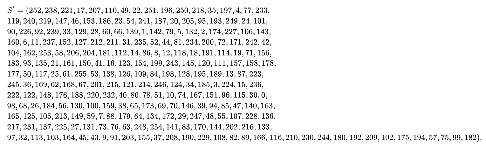
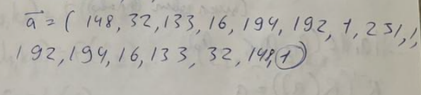
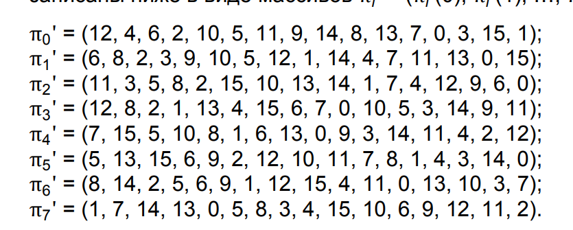
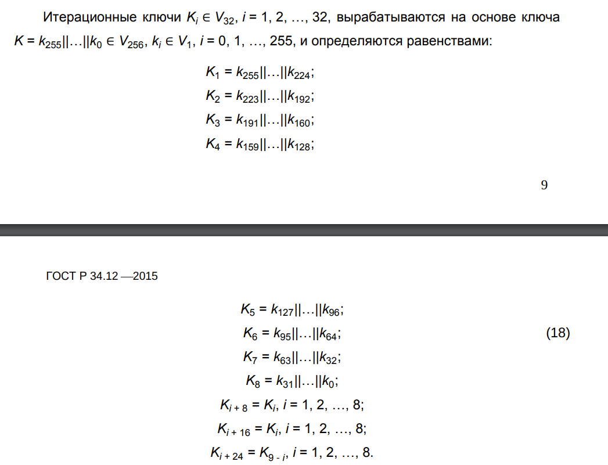

**В госте 2 шифра**:

1. Кузнечик

   * Блок - 128 бит

   * Ключ - 256 бит

2. Магма

   * Блок - 64 бит

   * Ключ - 256 бит

* Оба шифра имеют функциональное описание

**Байт - триедин**:

* это число от 0 до 255

* это цепочка битов $\{0,1\}^8$

* это элемент поля F = GF(256)

# Кузнечик

## Функции

главное поле $F=GF(256)=F[x]_{/p[x]\cdot f(x)}$

* $p(x)=x^8+x^7+x^6+x+1$

  * убедись, что p(x) не приводим над $\mathbb{Z}_2$ так же как и в AES

**перестановка**

  * $\Pi:\{0,1\}^8 > \twoheadrightarrow \{0,1\}^8$

* перестановка задаётся с помощью численного представления

*   

**Линейное преобразование**
   
  * $l:(\{0,1\}^{8})^{16} \to \{0,1\}^8$

  * ещё можно записать как
    
    * $l(F^{16}) \to F$
    
    * $l(\vec{x})= (\vec{x}, \vec{a})$
    
      * это скалярное умножение на $\vec{a}$. Умножение проводится в поле $F$, сложение это XOR   
    
      * $\vec{a} =$ см фото
      
      * 

$X[k]: \{0,1\} ^ {128} > \twoheadrightarrow \{0,1\} ^ {128}$

* X[k]\(a\)= a $\bigoplus$ k, где $k \in \{0,1\}^{128}$

$S:\{0,1\}^{128} > \twoheadrightarrow \{0,1\}^{128}$

* разделили a на 16 кусочков размером с байт

  * S(a) = $S(a_15 || a_14 || \cdots || a_0) = (\Pi(a_{15})||\Pi(a_{14})|| \cdots || \Pi(a_{0}))$

* Можно изготовить обратную функцию  

  * $S^{-1} = (\Pi^{-1} || \cdots ||\Pi^{-1})$

$R:\{0,1\}^{128} >\twoheadrightarrow\{0,1\}^{128}$

* каждый кусочек по байту

* $R(a)= R(a_{15} || \cdots || a_0) = l(a_{15}, \cdots, a_0) || a_{15}||a_{14} || \cdots ||a_1$

* $R^{-1}(a) = R^{-1}(a_{15} || \cdots || a_0) = a_{15}||a_{14} || \cdots ||a_1 || l(a_{15}, \cdots, a_0)$$

  * Чтобы доказать $R^{-1}(a)$ - это действительно обратный, то $\measuredangle (R^{-1}(R(a)))$. 
  
$L = R^{16}$

* $L^{-1} = (R^{-1})^{16}$

## Алгоритм построения ключа

**Вход:**

* $k\in\{0,1\}^{256}$

**Выход**

* $k_1, \cdots k_{10} \in \{0,1\}^{128}$

$k_1k_2 = k$

$(k_3,k_4) = F(C_8)(F(C_7)\cdots F(C_1)(k_1,k_2))$

$(k_5,k_6) = F(C_16)(F(C_15)\cdots F(C_9)(k_3,k_4))$

$\cdots$

$(k_9, k_{10}) = F(C_{32})(F(C_{31})\cdots F(C_{25})(k_7,k_8))$

где 

* $C_i = L(i)$

  * мы i представляем как цепочку из 128 бит и применяем к нему функцию L

* $F(C):\{0,1\}^{128} \times \{0,1\}^{128} > \twoheadrightarrow \{0,1\}^{128} \times \{0,1\}^{128}$
  
  * $F(C)(a_1,a_0) = (L(S(X(C)(a_1))) XOR (a_0),a_1)$

## Шифрование

$E_k(a) = X[k_{10}]LSX[k_9] \cdots L(S(X[k_1](a)))$

* Функции применяются справа налево

* По существу - 9 раундов

* по суть $X[k_i]$ - прибавление k_i ключа

* S - сильно нелинейное локальное преобразование

* L - линейное локальное преобразование

## Расшифрование

$D_k(a) = X[k_1]S^{-1}L^{-1}X[k_2] \cdots S^{-1}L^{-1}X[k_{10}](a)$

# Достоинства

* раундов меньше

* быстрее ГОСТа, DES

* описание проще чем у AES
# Недостатки

* есть функция L - которая долго считается

# Магма

**Фиксированные перестановки**
$\Pi_i:\{0,1\}^4 >\twoheadrightarrow \{0,1\}^4$

## Функции

$t:\{0,1\}^{32} \to \{0,1\}^{32}$
* $t(a) = t(a_7 || a_6|| \cdots || a_0) = \Pi_7(a_7) || \cdots || \Pi_0(a_0)$

$g[k]: \{0,1\}^{32} \to \{0,1\}^{32}$

* $g[k](a) = (t(a \boxplus k)) \ll 11$

* $\boxplus$ - это сложение по модулю 32

$G[k]: \{0,1\}^{32}\times \{0,1\}^{32} \to \{0,1\}^{32}\times \{0,1\}^{32}$

* $G[k](a_1, a_0) = (a_0, g[k](a_0) \bigoplus a_1)$

$G^{*}[k]: \{0,1\}^{32}\times \{0,1\}^{32} \to \{0,1\}^{64}$

* $G^{*}[k](a_1, a_0) = (g[k](a_0) \bigoplus a_1) || a_0$

## Алгоритм построения раундовых ключей ключей

Берём k и бьем его на 8 частей

$k = k_1||k_2||\cdots||k_8$

Берём k и бьем его на 8 частей, но нумеровать начинаем с 9

$k = k_9||k_{10}||\cdots||k_{16}$

и тд кроме последнего 
последний
$k=k_{32}||k_{31}||\cdots||k_{25}$

## Шифрование

$E_k(a) = E_k(a_1||a_0) = G^*[k_{32}](G[k_{31}](\cdots(G[k_1](a_1,a_0))))$

* 32 раунда конструкции Фейстеля

## Расшифрование

$D_k(a) = D_k(a_1||a_0) G^*[k_{1}](G[k_2](\cdots(G[k_1](a_1,a_0))))$

# Достоинства

* ликвидированы долговременные ключи. Поставлены фиксированные перестановки у ГОСТА 89 года

* самый древний действующий стандарт

# Недостатки

* медленный шифр за счёт малого блока и 32 раундов
