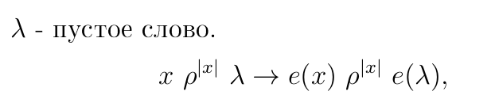
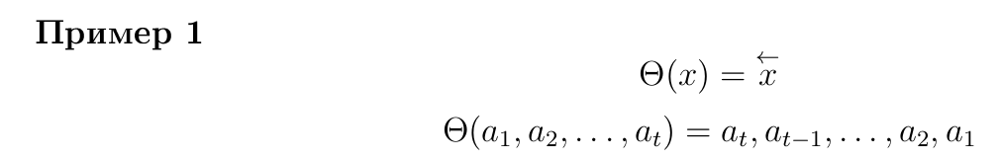
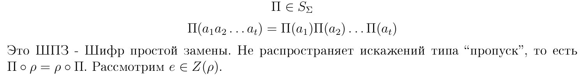
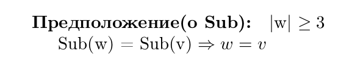

# ОПР (Содержание слова)

**Содержание слова $w \in \Sigma^{*}$** это $S(w) = \{a \in \Sigma| |w|_a > 0\}$

# ОПР(централизатор)

$Z(\rho) = \{e: \mathcal{M} >\twoheadrightarrow \mathcal{M}| \rho \circ e = e\circ \rho\}$

# Лемма 3

$\forall e \in Z(\rho): \forall x \in \mathcal{M}: |e(x)| = |x|$

## Д-ВО

Если $e(x) \rho ^{|x|-1}e(\lambda)$ , 

* то т.к  $e^{-1}\in Z(\rho)$, применяем $e^{-1}$ его к лч и пч
  
 то $x \rho ^{|x|-1}\lambda \bigotimes$

Получается, что $(e(x), e(\lambda)) \in \rho^{|x|}$, но $(e(x), e(\lambda)) \not \in \rho^{|x|-1}$ 

* $e(\lambda)$ получается из $e(x)$ вычеркиванием ровно $|x|$ букв
  
Т.е $|e(x)| = |x| + |e(\lambda)|$

$\Rightarrow |e(x)|\ge |x|$

$e(x)\rho^{|e(x)|}\lambda \Rightarrow$

* подействуем $e^{-1}$

$x \rho^{|e(x)|}e^{-1}(\lambda)$

если бы 
$x \ \rho^{|e(x)|-1}e^{-1}(\lambda)$, то $e(x)\rho^{|e(x)|-1}\lambda \bigotimes$

т.е $|x| = |e(x)| + |e^{-1}(\lambda)| \Rightarrow |x| \ge |e(x)|$

$\blacksquare$

Итак $e \in Z(\rho) \Rightarrow \forall k: e(\Sigma^k) = \Sigma^k$

# Пример 1

* если удалим символ из x, а потом применим $\theta$, то получим такой же результат как будто бы мы применили $\theta$, а затем удалили символ из x $\Rightarrow$

$\theta \circ \rho = \rho \circ \theta \Rightarrow \theta \in Z(\rho)$

# Пример 2(шифр простой замены)

# Замечание

$(\theta \circ \Pi) \circ \rho = \rho \circ(\theta \circ \Pi)$ (по стабильности относительно $\subseteq$)

$\theta \circ \Pi \in Z(\rho)$

Пусть $e: \mathcal{M} >\twoheadrightarrow \mathcal{M}: \forall k: e(\Sigma^k)=\Sigma^k$

Тогда $e(\Sigma) = \Sigma \Rightarrow e: \Sigma >\twoheadrightarrow \Sigma$

Определим $\alpha: \mathcal{M} >\twoheadrightarrow \mathcal{M}: \alpha(x_1, \cdots,x_k) = e(x_1)e(x_2)\cdots e(x_k)$

* по сути задали шифр простой замены, индуцированный функцией e

e - произвольная биекция $\Rightarrow e^{-1}$- биекция

$\alpha^{-1} \circ e:\mathcal{M} >\twoheadrightarrow \mathcal{M}$

$((\alpha^{-1} \circ e)(x_1, \cdots, x_k))= e(e^{-1}(x_1),e^{-1}(x_2), \cdots e^{-1}(x_k))$

$\forall x_i \in \Sigma:(\alpha^{-1} \circ e)(x_i)=x_i$

# Лемма 4

Если $e \in Z(\rho)$

Тогда $\forall x \in \mathcal{M}: S((\alpha^{-1}\circ e)(x)) = S(x)$

## Д-ВО

* $e \in Z(\rho)$

* $\alpha \in Z(\rho) \Rightarrow \alpha^{-1} \in Z(\rho)$

* $\Rightarrow \alpha^{-1}\circ e\in Z(\rho) \Rightarrow$ 

по лемме 3 сохраняет длину
  
$\measuredangle (\alpha^{-1} \circ e)(a_1, a_2, \cdots a_k) = b_1b_2\cdots b_k$ 

$b_1b_2\cdots b_k \rho^{k-1}b_i(\forall i)$

$\Rightarrow \forall i: b_i \in S((\alpha^{-1}\circ e)(a_1\cdots a_k))$

$\measuredangle (\alpha^{-1}\circ e)^{-1} \circ (\alpha^{-1}\circ e)(a_1, \cdots a_k) = (a_1, \cdots a_k)$

* т.к $(\alpha^{-1}\circ e)$-тождественная функция на алфавите, то 
  
$(a_1, \cdots a_k) \rho^{k-1}(\alpha^{-1}\circ e)(b_i) = b_i\Rightarrow (a_1, \cdots a_k) \rho^{k-1} b_i$ 

т.е $b_i \in S(a_1\cdots a_k)$

**Получаем, что $S((\alpha^{-1}\circ e)(a_1,\cdots a_k)) \subseteq S(a_1 \cdots a_k)$**

* в силу $(\alpha^{-1} \circ e)(a_1, a_2, \cdots a_k) = b_1b_2\cdots b_k$

$(\alpha^{-1}\circ e) ^{-1} (b_1\cdots b_k) = a_1\cdots a_k \rho ^{k-1} a_i (\forall i)$

* т.к $(\alpha^{-1}\circ e)$-тождественная функция на алфавите, то 

$(\alpha^{-1}\circ e) \circ (\alpha^{-1}\circ e) ^{-1} (b_1\cdots b_k) \rho ^{k-1} (\alpha^{-1}\circ e) a_i (\forall i) = a_i$

**Получаем, что $S(a_1 \cdots a_k) \subseteq S((\alpha^{-1}\circ e)(a_1,\cdots a_k))$**

$\blacksquare$

# Теорема Глухова(Главная часть билета)

$e: \mathcal{M} > \twoheadrightarrow \mathcal{M}, L \ge 3$

* т.е длина слов не менее 3

Тогда 

$e \in Z(\rho), т.е \ \rho \circ e = e \circ \rho \Leftrightarrow e = \begin{cases}
    \Pi(\text{из примера}) \\
    \theta \circ \Pi  = \Pi \circ \theta, \theta = \theta^{-1}
\end{cases}$

## Д-ВО $\Leftarrow$
д-но, т.к проверили, что $\Pi, \theta, \Pi \circ \theta \in Z(\rho)$

## Д-ВО $\Rightarrow$

Берём $e \in Z(\rho)$. Пусть $\Pi = \alpha_e$.

Нужно показать, что 

* либо $e = \Pi \Rightarrow \Pi ^{-1} \circ e = \epsilon$

* либо $e = \Pi \circ \sigma \Rightarrow \theta^{-1} \circ \Pi^{-1} \circ e = \epsilon$

$\measuredangle \Pi^{-1}\circ e$, действующая на $\Sigma ^ 2$

* в силу лем 3 и 4 отображение сохраняет длину и содержание
  
$(\Pi^{-1}\circ e) (ab) = \begin{cases}
    ab \\
    ba
\end{cases}$

* если получаем ab, то оставляем его

* если получаем ba, то применяем $\theta$

т.е выбрав $\varphi = \begin{cases}
    либо \ \Pi^{-1} \circ e \\
    либо \ \theta \circ \Pi^{-1} \circ e
\end{cases}$, можно обеспечить $\varphi(ab) = ab$ для конкретных букв a и b

* посмотрим действие $\Pi^{-1}\circ e(ab)$ на пары из 3 букв

$\measuredangle \forall a,b,c \in \Sigma:$

1. $\Pi^{-1}\circ e(ab)=\begin{cases}
    \text{либо} \ ab \\
    \text{либо} \ ba
\end{cases}$
   
1. $\Pi^{-1}\circ e(ac)=\begin{cases}
    \text{либо} \ ac \\
    \text{либо} \ ca
\end{cases}$
   
1. $\Pi^{-1}\circ e(bc)=\begin{cases}
    \text{либо} \ bc \\
    \text{либо} \ cb
\end{cases}$

* возможны случаи:
  
  1. Во всех 3 местах сохраняется порядок букв
  
  2. Во всех 3 местах инвертируется порядок букв
  
  3. В 2 местах сохраняется порядок букв, а в третьем месте инвертируется
  
  4.  В 2 местах инвертируется  порядок букв, а в третьем месте сохраняется

Допустим, что мы находимся либо в случае 3 либо в случае 4

* сейчас рассмотрим 3 случай

**Б.О.О считаем, что** 

* $\Pi^{-1}\circ e(ab) = ab \Rightarrow \Pi^{-1}\circ e(ba) = ba$
  
* $\Pi^{-1}\circ e(bc) = bc \Rightarrow \Pi^{-1}\circ e(cb) = cb$

* $\Pi^{-1}\circ e(ac) = ca \Rightarrow \Pi^{-1}\circ e(ca) = ac$

**Теперь подействуем $\Pi^{-1} \circ e$ на abc=w**

$\Pi^{-1} \circ e (abc)$, где $S(w)= \{a,b,c\}, |w|=3$ 

т.к $\Pi^{-1} \circ e \in Z(\rho)$ и $abc \ \rho \ ab \Rightarrow w \rho (\Pi^{-1} \circ e) (ab)=ab \Rightarrow$ **а стоит до b в слове w**

аналогично:

* $abc \ \rho \ bc \to w \ \rho \ bc \Rightarrow$  **b стоит до c в слове w** 

* $abc \ \rho \ ac \to w \ \rho \  ca \Rightarrow$ **с стоит до a в слове w**

приходим к противоречию т.к слова с такими отношениями порядка следования букв не существует$\bigotimes$

* случай 4 можно свести к 3 случаю, если рассматривать $\theta \cdot \Pi^{-1} \cdot e$

* т.е инвертированные варианты инвертируются ещё раз, т.е их порядок не изменится. Вариант с сохранением порядка инвертируется

$\Rightarrow$ **не может быть случаев 3 и 4**

$\Rightarrow$ **Значит это либо случай 1 либо 2**

т.е $\forall a,b,c \in \Sigma$ можно так выбрать $\varphi_{\{a,b,c\}} = \begin{cases}
    \text{либо} \ \Pi^{-1} \circ e \\
    \text{либо} \ \theta \circ \Pi^{-1} \circ e
\end{cases}$ что $\varphi_{\{a,b,c\}}(x,y) = xy \ (\forall x,y \in \{a,b,c\})$ т.е $(\varphi_{\{a,b,c\}}|_{\{a,b,c\}} = \epsilon)$

* $\varphi$ действует тождественно на $\{a,b,c\}$

Берем $a_1, a_2, a_3, a_4 \in \Sigma$

составим:

* $\varphi_{\{a_1,a_2,a_3\}}$

* $\varphi_{\{a_1,a_2,a_4\}}$

**Покажем, что $\varphi_{\{a_1,a_2,a_3\}}$ и $\varphi_{\{a_1,a_2,a_4\}}$ - одинаковые, в обоих либо есть $\theta$ либо её нет**

* $\varphi_{\{a_1,a_2,a_3\}}$ и $\varphi_{\{a_1,a_2,a_4\}}$ действуют тождественно на $a_1a_2$, поэтому они либо вида $\Pi^{-1} \circ e$ либо $\theta \circ \Pi^{-1} \circ e$

т.е $\varphi_{\{a_1,a_2,a_3\}}$ =  $\varphi_{\{a_1,a_2,a_4\}}$

Заметим, что $\{a_1, a_2, a_3, a_4\}^2 \subseteq \{a_1,a_2,a_3\}^2 \cup \{a_1, a_2, a_4\}^2$

* любое слово длины 2 состоит:

  * либо из букв из $\{a_1, a_2, a_3, a_4\}$

  * либо из букв из $\{a_1, a_2, a_3, a_3\}$

т.е $\varphi_\{a_1, a_2, a_3\} = \varphi_\{a_1, a_2, a_4\}|_{\{a_1, a_2, a_3, a_4\}} = \epsilon$

**теперь сделаем индукцию по k**

пусть $\varphi = \begin{cases}
    \text{либо} \ \Pi^{-1} \circ e \\
    \text{либо} \ \theta \circ \Pi^{-1} \circ e
\end{cases}$

* $\varphi$ действует тождественно на $\{a_1,a_2, \cdots, a_k\}$
  
$\varphi|_{\{a_1,a_2, \cdots, a_k\}^2} = \epsilon$

$\varphi_{\{a_1, \cdots a_k\}} = \begin{cases}
    \text{либо} \ \Pi^{-1} \circ e \\
    \text{либо} \ \theta \circ \Pi^{-1} \circ e
\end{cases}$

$\varphi(a_1, a_2) = a_1a_2 = \varphi_{\{a_1\cdots a_k\}}(a_1, a_k)\Rightarrow$

* у них одинаковый тип

$\varphi = \varphi_{\{a_1, \cdots, a_k\}}$

т.е  $\{a_1, \cdots, a_k, a_{k+1}\}^2 \subseteq \{a_1, \cdots, a_k\} \cup \{a_1, \cdots, a_k, a_{k+1}\}$

т.е $\exist \ \varphi = \begin{cases}
    \text{либо} \ \Pi^{-1} \circ e \\
    \text{либо} \ \theta \circ \Pi^{-1} \circ e
\end{cases}$ такая что $\varphi|_{Sigma^2} = \epsilon$

**Дальше переходим к словам большей длины**

* Здесь мы воспользуемся предложением

## ОПР Множество sub

$w \in \Sigma^{*}$, то $sub(w) = \{v \in \Sigma^{*}| w\ \rho \ v\} \backslash {w}$

## ОПР (Содержание слова)

**Содержание слова $w \in \Sigma^{*}$** это $S(w) = \{a \in \Sigma| |w|_a > 0\}$

# Предложение(Главная часть билета)

Проведем индукцию по k, чтобы показать, что $\varphi|_{\Sigma^k} = \epsilon$

$\measuredangle w\in \Sigma^{k+1}$. Покажем, что $\varphi(w) = w$

$\measuredangle sub(w) \subseteq \Sigma^k$. 

$|x|=k, x \in sub(w) \Leftrightarrow w \ \rho \ x \Leftrightarrow$

* т.к $\varphi = \begin{cases}
    \text{либо} \ \Pi^{-1} \circ e \\
    \text{либо} \ \theta \circ \Pi^{-1} \circ e
\end{cases} \Rightarrow$ $\varphi \in Z(\rho)$

* 

$\Leftrightarrow \varphi(w) \rho \varphi(x) =$

* т.к $|x|=k$ по П.И 

x

Получаем, что $\varphi(w) \rho \ x \Leftrightarrow x \in sub(\varphi(w))$

т.е $sub(w) = sub(\varphi(w)) \Rightarrow$

* по предложению $k+1 \ge 3, 
 
$\varphi(w) = w$

$\blacksquare$

# ВЫВОД

Если хотим обеспечить нераспространение искажений, то придётся ограничиваться слабыми шифрами перестановки и многоалфавитной замены. Т.е можно вообще забить на это всё