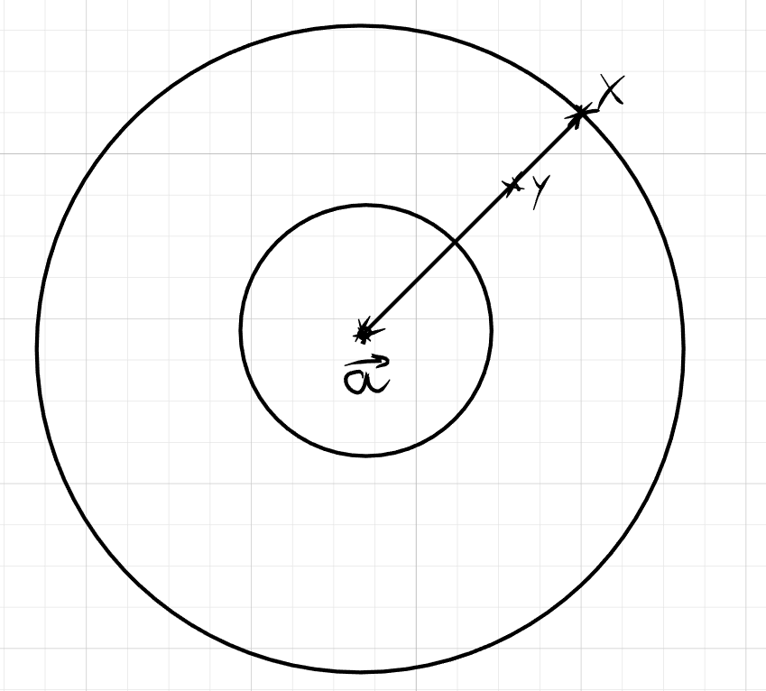

## ОПР(Изометрия)

$e : X \to X$ - **изометрия** относительно метрики $\rho$ на X, если $\forall a,b \in X: \rho(e(a),e(b)) = \rho(a,b)$

* инъективная функция на конечном множестве, т.е изометрия это биекция

# Важные примеры изометрий на $\Sigma ^ r$ относительно расстояния хэмминга

**1. Шифр перестановки**

$\sigma(a_1, \cdots, a_r) = a_{\sigma(1)}, \cdots, a_{\sigma(r)}$

* $\sigma \in S_r$ - перестановка длины r

* здесь в качестве ключа выступает $\sigma$

* $\sigma$ - это изометрия, которая не распространяет искажений типа "замена"

* чтобы расшифровать применяем к слову обратную перестановку

**2. Шифр многоалфавитной замены**

$\tau = (\tau_1, \tau_2, \cdots \tau_r) \in (S_\Sigma)^r$

$\tau(a_1, \cdots, a_r) = \tau_1(a_1) \cdots \tau_r(a_r)$

* это ШМЗ

* чтобы расшифровать применяем к каждой букве свою обратную перестановку

* это изометрия

# Теорема Маркова

$e \in E$-изометрия $\Leftrightarrow$ $\exist \sigma, \tau$ из важных примеров 1 и 2, что $e = \sigma \ \circ \ \tau$

* т.е e - это суперпозиция $\sigma$ и $\tau$

## Д-ВО $\Leftarrow$

$\tau$ и $\sigma$ - это изометрии, из замечания

покажем, что суперпозиция изометрий это снова изометрия

$\rho(e(x),e(y)) = \rho(\tau(\sigma(x)), \tau(\sigma(y))) =$

* т.к $\tau$ изометрия, то она сохраняет расстояние между прообразами

$\rho(\sigma(x), \sigma(y)) =$
 
* т.к $\sigma$ изометрия, то она сохраняет расстояние между прообразами
 
$\rho(x,y)$

$\blacksquare$

## Д-ВО $\Rightarrow$

Берём $\vec{a} = (a_1, a_2, \cdots, a_r) \in \Sigma^r$

Определим $\vec{\vec{a_i}} = (a_1, a_2, \cdots, a_{i-1}, \Sigma, a_{i+1}, \cdots)$

* на iой позиции любая буква из $\Sigma$

$\vec{a} \in \vec{\vec{a_i}}$

$e(\vec{a}) = \vec{c}$

**1. Покажем что $\exist j \in \{1, \cdots, r\}: e(\vec{\vec{a_j}}) = \vec{\vec{c_j}}$**

Пусть $\vec{d} \in$ $e(\vec{\vec{a_j}}) \backslash \{\vec{c}\} \Rightarrow$ $\exist \ \vec{b} \in \vec{\vec{a_j}}: \vec{d} = e(\vec{b})$

$\measuredangle \rho(\vec{d}, \vec{c}) = \rho(e(\vec{b}), e(\vec{a})) = \rho(\vec{b},\vec{a}) = 1$

* Если $\rho(\vec{b},\vec{a}) = 0$, то $\vec{d} = \vec{c} \Rightarrow \bigotimes$

$\Rightarrow \exist j: \vec{d} \in \vec{\vec{c_j}}$

* Покажем, что это j одинаково для всех d
  
Берём $\vec{d_1} \neq \vec{d_2}; \vec{d_1},\vec{d_2} \in e(\vec{\vec{a_j}})$.

$\exist \vec{b_1}, \vec{b_2} \in \vec{\vec{a_i}}$:

* $\vec{d_1}=e(\vec{b_1})$

* $\vec{d_2}=e(\vec{b_2})$

$\rho(\vec{d_1}, \vec{d_2}) = \rho(\vec{b_1},\vec{b_2})=1$

* $\rho(\vec{b_1},\vec{b_2}) \neq 0$, иначе $\vec{b_1}=\vec{b_2}\Rightarrow \vec{d_1}=\vec{d_2} \bigotimes$

Т.е j для $\vec{d_1}$ и $\vec{d_2}$ общее

* иначе $\rho(\vec{d_1}, \vec{d_2}) > 1$

$\Rightarrow \exist j: e(\vec{\vec{a_j}}) \subseteq \vec{\vec{c_j}}$

* e - инъективная функция

* размеры у множеств совпадают

* из этого следует, что множества равны

Мощности $|e(\vec{\vec{a_i}})| = |\vec{\vec{a_i}}| = |\Sigma| = |\vec{\vec{c_j}}| \Rightarrow e(\vec{\vec{a_i}}) = \vec{\vec{c_i}}$

Получаем, что:

$$\forall \vec{a} \in \Sigma^r \ \forall i \ \exist \  j: \tau_j \in S_\Sigma: e(a_1, \cdots, a_r) = (c_1, \cdots,c_{j-1}, \tau_j(a_i), c_{j+1}, \cdots, c_r)$$

**2. обозначим через $\vec{x} \in \Sigma^t:O_t(\vec{x}) = \{\vec{y}\in \Sigma ^ r | \rho(\vec{x}, \vec{y}) \le t\}$**

* $O_t(\vec{x})$ - окрестность слова $\vec{x}$ радиуса t

* в пункте 1 показали, что для фиксированного $a \in \Sigma ^ t$ единичная окрестность $\vec{a}$ переходит в единичную окрестность $\vec{c}$

$\exist \tau = (\tau_1, \cdots, \tau_r) \in (S_\Sigma)^r$ и 
$\exist \ \sigma \in S_r:$ $\forall \vec{x} \in O_1(\vec{a}): e(\vec{x}) = (\tau_1(a_{\sigma(1)}), \tau_2(a_{\sigma(2)}), \cdots, \tau_r(a_{\sigma(r)}))=$

* где $\sigma(j) = i$

$(\sigma \circ \tau)(\vec{a})$

т.е на $O_1(\vec{a}): e=\sigma \circ \tau \Rightarrow$

$\varphi = e \circ \tau^{-1} \circ \sigma^{-1} = \epsilon$ - тождественная функция на $O_1(\vec{a})$

индукцией по t покажем, что $\varphi = \epsilon$ на $O_t(\vec{a})$

**Б.И**

уже доказали для случая t = 1

**Ш.И**

Если $\vec{x} \in O_t(\vec{a})$

Если $\rho(\vec{x}, \vec{a}) < t \Rightarrow$ применяем П.И

Д-жем для $\rho(\vec{x}, \vec{a}) = t$

пусть $\rho(\vec{y},\vec{a})=t-2$, причем y такой, что $\rho(\vec{y},\vec{x}) = 2$

* $t\ge 2$

$\measuredangle O_1(\vec{x}) \cap O_1(\vec{y})$

* $\vec{x} = x_1, x_2, \cdots x_\alpha, \cdots, x_\beta, \cdots, x_r$

* $\vec{y} = y_1, y_2, \cdots y_\alpha, \cdots, y_\beta, \cdots, y_r$

* в словах $\vec{x}$ и $\vec{y}$:

  * $x_\alpha \neq y_\alpha$

  * $x_\beta \neq y_\beta$

  * остальные буквы совпадают

Получается, что есть ровно 2 слова

* $\vec{u} = u_1 u_2 \cdots u_\alpha \cdots u_\beta \cdots u_r$
  * $u_\alpha = x_\alpha$
  * $u_\beta = y_\beta$ 
* $\vec{v} = v_1 v_2 \cdots v_\alpha \cdots v_\beta \cdots u_r$
  * $v_\alpha = y_\alpha$
  * $v_\beta = x_\beta$

$\Rightarrow O_1(\vec{x}) \cap O_1(\vec{y}) = \{\vec{u}, \vec{v}\}$

$\measuredangle O_1(\vec{v}) \cap O_1(\vec{u}) = \{\vec{y}, \vec{x}\}$

по неравенству треугольника:

$$
\rho(\vec{u},\vec{a}) \le \rho(\vec{u}, \vec{y}) + \rho(\vec{y}, \vec{a}) \le t-1
$$

* $\rho(\vec{u},\vec{y}) = 1$, т.к $\vec{y} \in O_1(\vec{v}) \cap O_1(\vec{u})$ 

* $\rho(\vec{y}, \vec{a}) = t-2$, так выбрали точку y

**аналогично показываем** $\rho(v,a) \le t-1$

По П.И $\varphi(\vec{u}) = \vec{u}$, $\varphi(\vec{v}) = \vec{v}$, $\varphi(\vec{y}) = \vec{y}$

* $\varphi$ - изометрия, т.к суперпозиция изометрий

$\rho(\varphi(\vec{x}), \varphi(\vec{u})) = \rho(\vec{x}, \vec{u}) = 1$

$\rho(\varphi(\vec{x}), \varphi(\vec{v})) = \rho(\vec{x}, \vec{v}) = 1$

получаем, что 

$\varphi(\vec{x}) \in O_1(\vec{u})\cap O_1(\vec{v}) = \{\vec{x}, \vec{y}\}$, 

но $\varphi(\vec{x}) \neq \varphi(\vec{y}),$ т.к $(\vec{x} \neq \vec{y})$ 

$\Rightarrow \varphi(\vec{x}) =\vec{x}$

Доказали шаг индукции

Любое слово из $\Sigma^r$ находится в $O_r(\vec{a})$, т.е $\varphi: \Sigma ^ r >\twoheadrightarrow \Sigma^r$

Причем $\varphi = \epsilon$, т.е $e \circ \tau^{-1} \circ \sigma^{-1} = \epsilon \Rightarrow e = \sigma \circ \tau$

$\blacksquare$