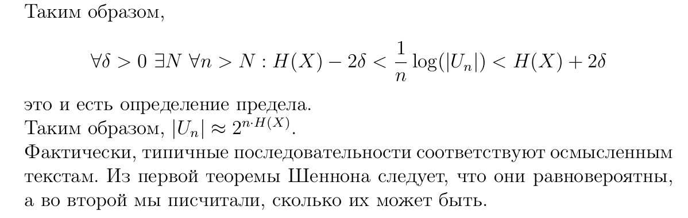

# Теорема Шеннона о доле типичных последовательностей

$\lim\limits_{n\to\infty}\frac{1}{n}\cdot log(|U_n|)=H(x)$
* т.е с ростом n кол-во типичных последовательностей ведёт себя как $2^{n(H(x))}; |U_n|\thickapprox 2^{n(H(x))}$

## Д-ВО (из следствия)
* сложим по U левое **неравенство из следствия из первой теоремы Шеннона**

$\sum_{u\in U_n}2^{-n(H(x)+\sigma)} < \sum_{u\in U_n}P(x^n=u) = P(u\in U_n)\le 1 \Rightarrow$

$|U_n|\cdot 2^{-n(H(x)+\sigma)} < 1$

* сложим по U правое **неравенство из следствия из первой теоремы Шеннона**

$\sum_{u\in U_n}P(x^n=u) <|U_n|\cdot2^{-n(H(x)-\sigma)}\Rightarrow$ 

* вероятность противоположного события $P(u\in V_n) < \epsilon, т.е когда слово редкое$
  
$\forall \epsilon > 0: 1-\epsilon < P(u\in U_n)$

* т.к $\forall \ \epsilon$,то можно взять $\epsilon=0 \Rightarrow$

$1 < |U_n|\cdot 2^{(-n(H(x))-\sigma)}$

* объединим неравенства
  
$|U_n|\cdot 2^{-n(H(x)+\sigma)} < |U_n| < |U_n|\cdot 2^{(-n(H(x))-\sigma)}\Rightarrow$ 

$H(x)-\sigma < \frac{1}{n}log(|U_n|)<H(x)+\sigma \Rightarrow$

$|\frac{1}{n}\cdot log(|U_n|)-H(x)| < \sigma$

$\blacksquare$
