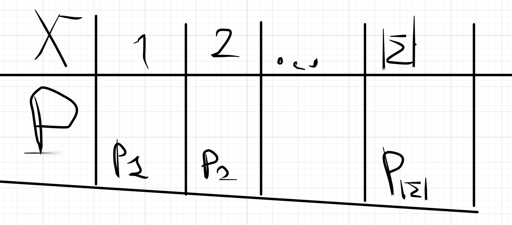
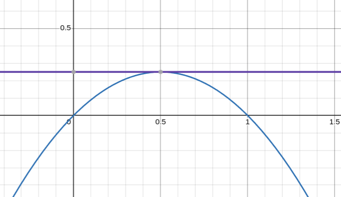
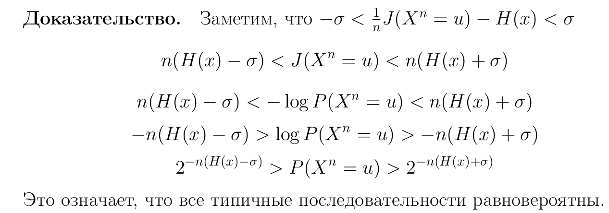

$\mathcal{X}$ - Случайная величина распределена на $\{1,2,...||\Sigma||\}$

## ОПР (Позначная модель открытого текста)

Пусть открытый текст $M = x_1 x_2 \cdots x_n$ где $\forall i, j: x_i, x_j$ - независимые и каждая $x_i$ это случайная величина X. Такая модель называется **позначной моделью открытого текста**

$x_1, \cdots x_n = x^n$ - цепочка символов, которая распределена на $\Sigma ^ n$

$w_1, \cdots w_n = w$ - слово.  $w \in \Sigma ^ n$

Тогда $P(x^n = w)=\prod_{i=1}^n P(x_i=w_i) = \prod_{i=1}^n P(X=w_i)$

$J(x^n=w)=\sum_{i=1}^n J(x_i=w_i)$

Можно разделить мн-во $\Sigma^n$ на 2 кучки:

1. **Типичные** слова

2. **Редкие** слова

# Теорема Шеннона о типичных и редких последовательностях(Главная часть билета)

$\forall \epsilon > 0, \forall \sigma > 0
\ \exist N \ \forall n > N: \exist \ \{U_n, V_n\}$-разбиение $\Sigma^n$:

* $U_n$ - мн-во типичных слов

* $V_n$ - мн-во редких слов
  
1. $\forall u \in U_n: |\frac{1}{n}J(x^n=u)-H(x)|<\sigma$
    * средняя информация на один символ это примерно энтропия одного символа

2. $\sum_{v\in V_n}P(x^n = v) < \epsilon$
   * слова реально редкие 

## Д-ВО

$P(x^n=w) = \prod_{j=1}^n p_j^{|w|_j}$ ($|w|_j$-кол-во букв j в слове w)

Выберем $\delta > 0$

* $U_{n\delta} = \{u\in \Sigma^n | \forall j \in\{1,2 \cdots |\Sigma|\}:||u|_j-np_j|\le n\delta \}$
  
  * $np_j$ - это мат ожидание в схеме бернулли

* $V_{n\delta} = \Sigma^n \backslash U_{n\delta}$=$\bigcup_{j=1}^{|\Sigma|}\{u\in\Sigma^n||u|_j-np_j|\ge n\delta\}$=$\bigcup_{j=1}^{|\Sigma|}V_{n\delta_j}$

  * $V_{n\delta_j} = \{u \in \Sigma^n| |u|_j-np_j|> n\delta_j\}$

## Д-ВО(первого пункта)

Берем $u\in U_{n\delta}$. 

$\measuredangle P(x^n = u) = \prod_{j=1}^{|\Sigma|} p_j^{|u|_j}=\prod_{j=1}^{|\Sigma|} p_j^{np_j+n\delta\theta_j}$,где $|\theta_j| < 1$

$J(x^n=u) = -log(P(x^n=u))=-\sum_{j=1}^{|\Sigma|}(np_j+n\delta\theta_j)\cdot log(p_j)$

$H(x) = -\sum_{j=1}^{|\Sigma|}p_j\cdot log(p_j)$

$\measuredangle |\frac{1}{n}\cdot J(x^n=u)-H(x)| = |-\delta\cdot \sum_{j=1}^{|\Sigma|}\theta_j\cdot log(p_j)|<-\delta\sum_{j=1}^{|\Sigma|}log(p_j)=$

* если в качестве $\delta$ взять $\delta=\frac{\sigma}{-\sum_{j=1}^{|\Sigma|}}$

$\sigma$

$\blacksquare$

## Д-ВО(второго пункта)

$x^n = v, P(v \in V_n)$ = $P(v\in \bigcup_{j=1}^{|\Sigma|}V_{n\delta_j})\le \sum_{j=1}^{|\Sigma|}P(v\in V_{n\delta_j})$ =

$\sum_{j=1}^{|\Sigma|}p(||v|_j-np_j|\ge n\delta)\le$

* Т.к живем в схеме независимых испытаний бернулли, то $M[|v|_j]=np_j$, $D[|v|_j]=np_j(1-p_j)$

* Мат.Ожидание центрированной случайной величины равно 0
  * $M[|v|_j-np_j]=0$

* **По н-ву Чебышева** $P(|X|\ge \epsilon)\le\frac{D[x]}{\epsilon^2}$

$\sum_{j=1}^{|\Sigma|}\frac{np_j(1-p_j)}{n^2\delta^2}\le$

* $p_j(1-p_j)\le \frac{1}{4}$, т.к $p_j(1-p_j)$- парабола с ветками вниз, у которой вершина находится в точке $(\frac{1}{2}, \frac{1}{4})$

* 

$\frac{1}{\delta^2n}\cdot\sum_{j=1}^{|\Sigma|}\frac{1}{4}=\frac{|\Sigma|}{4n\delta^2}<\epsilon$ 

* $n > N$, где $N = \frac{|\Sigma|}{4\delta^2\epsilon}$ 

$\blacksquare$

# Следствие из теоремы

$\forall n > N, \forall u \in U_n: P(x^n=u)\in (2^{-2n(H(x)+\sigma)}, 2^{-2n(H(x)-\sigma)})$

## Д-ВО

$\blacksquare$
