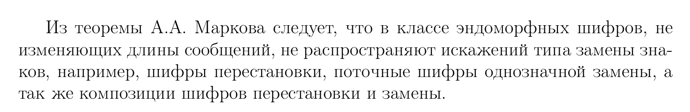

## ОПР (Эндоморфная криптосистема)

**Эндоморфная КС** - КС, у которой множество открытых текстов совпадает с множеством с множеством криптограмм.

Пусть 

* $\Sigma$ - алфавит

* $\mathcal{M} = \mathcal{C} = \bigcup\limits_{k=0}^L \Sigma^k$. 
  * т.е открытые тексты и криптограмы это цепочки букв длины не более L 

* $E(\_, k): \mathcal{M} \rightarrow \mathcal{M}$

* $E(\_, k): \mathcal{M} >\twoheadrightarrow \mathcal{M}$

  * т.к обратная к $E(\_, k): \mathcal{M} \rightarrow \mathcal{M}$ - тоже функция

  * $E(\_, k)$ - это биекция

Есть множество $\mathcal{M}$, на котором много биекций Е, а D это $E^{-1}$

Т.е вместо Криптосистемы $(\mathcal{M},\mathcal{C},\mathcal{K},E,D)$ мы можем рассматривать её упрощенный вариант 
$(\mathcal{M}, E)$, где $E = \{e | e: \mathcal{M} >\twoheadrightarrow \mathcal{M}\}$

* Каждая е это функция со своим ключом

## ОПР(Искажения типа "замена")

**Искажения типа "замена"** - это Б.О $\alpha \in \mathcal{M} \times \mathcal{M}:$
$$(u,v)\in \alpha \Leftrightarrow \exist ! k \in \{1,\cdots,n\}:u_k \neq v_i$$

где:

* $u = u_1, \cdots u_n$ 

* $v = v_1, \cdots v_n$

* $\forall i: u_i, v_i \in \Sigma$

Если по простому, то 2 слова u и v отличаются только в одной позиции 

## ОПР(Расстояние Хэмминга между словами)

**Расстояние Хэмминга между словами** $u \in \Sigma^n$ и $v \in \Sigma^n$ это
$$|\{i| i\in \{1, \cdots, n\}, u_i \neq v_i\}| = \rho(u,v)$$

* **расстояние хэмминга это метрика**

## ОПР(шифр не распространяющий искажений типа "замена")

**шифр $(\mathcal{M},\mathcal{C})$ не распространяет искажений типа "замена"**, если:

* $\forall x, y \in \Sigma^r, \forall e \in E: \rho(e^{-1}(x), e^{-1}(y)) \le \rho(x,y)$
  
  * $r \in \{0, \cdots ,L\}$

* Расстояние хемминга между открытыми текстами не больше чем расстояние хемминга между криптограммами

# Лемма о метрике и биекции

Пусть 

* $\rho$ - произвольная метрика на $\Sigma^n$

* $e: \Sigma ^ r >\twoheadrightarrow \Sigma ^r$

Тогда 

$\forall x, y \in \Sigma^r: \rho(e^{-1}(x), e^{-1}(y)) \le \rho(x,y) \Leftrightarrow \forall x, y \in \Sigma^r: \rho(e^{-1}(x), e^{-1}(y)) = \rho(x,y)$

## Д-ВО $\Leftarrow$
Очевидно следует из равенства

$\blacksquare$

## Д-ВО $\Rightarrow$

распространим e на $S = \Sigma^r \times \Sigma^r$

* $e: S >\twoheadrightarrow S$ по правилу $e(x,y)=(e(x), e(y))$

$\measuredangle \sum\limits_{(x,y) \in S} \rho(e^{-1}(x,y))\le \sum\limits_{(x,y)\in S}\rho(x,y)$ 

Если $\exist (x,y)\in S: \rho(e^{-1}(x,y)) < \rho(x,y)$, то знак неравенства для сум был бы строго меньше $\bigotimes$ 

$\blacksquare$

## ОПР(изометрия)

$e : X \to X$ - изометрия относительно метрики $\rho$ на X, если $\forall a,b \in X: \rho(e(a),e(b)) = \rho(a,b)$

* инъективная функция на конечном множестве, т.е изометрия это биекция

# Важные примеры изометрий на $\Sigma ^ r$ относительно расстояния хэмминга

**1. Шифр перестановки**

$\sigma(a_1, \cdots, a_r) = a_{\sigma(1)}, \cdots, a_{\sigma(r)}$

* $\sigma \in S_r$ - перестановка длины r

* здесь в качестве ключа выступает $\sigma$

* $\sigma$ - это изометрия, которая не распространяет искажений типа "замена"

* чтобы расшифровать применяем к слову обратную перестановку

**2. Шифр многоалфавитной замены**

$\tau = (\tau_1, \tau_2, \cdots \tau_r) \in (S_\Sigma)^r$

$\tau(a_1, \cdots, a_r) = \tau_1(a_1) \cdots \tau_r(a_r)$

* это ШМЗ

* чтобы расшифровать применяем к каждой букве свою обратную перестановку

* это изометрия

# Теорема Маркова

$e \in E$-изометрия $\Leftrightarrow$ $\exist \sigma, \tau$ из важных примеров 1 и 2, что $e = \sigma \ \circ \ \tau$

* т.е e - это суперпозиция $\sigma$ и $\tau$

## Д-ВО cмотри в билете про Т.Маркова

