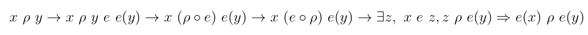
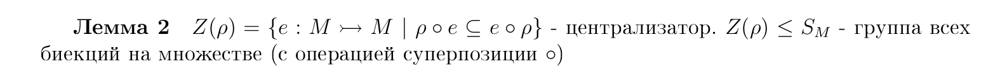
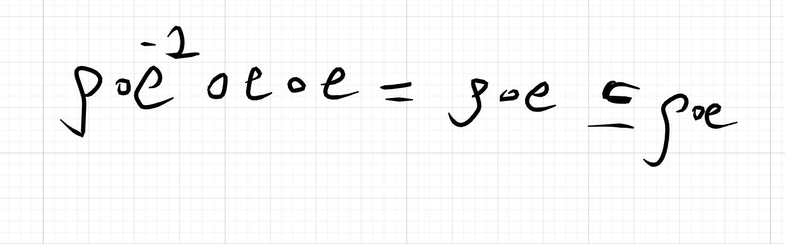

## ОПР(Искажение типа "Пропуск")

**Искажение типа "Пропуск"** это Б.О $\alpha: \mathcal{M} \times \mathcal{M}$:

$$(u,v)\in \alpha \Leftrightarrow \text{v - получено из u вычеркиванием одной буквы}$$

**Определим также Б.О $\rho: \mathcal{M} \times \mathcal{M}$:**

$$(u,v)\in \rho \Leftrightarrow \begin{cases} \text{либо } (u,v)\in \alpha \\ \text{либо } u=v \end{cases}$$

## ОПР(шифр, не распрастраняющий искажений типа "пропуск")

**шифр $(\mathcal{M}, E)$, не распрастраняет искажений типа "пропуск"** - если $\forall e \in E, \forall \vec{x}, \vec{y} \in \mathcal{M}, \forall k \le |\vec{x}|:$

$$
\vec{x} \rho^k \vec{y} \Rightarrow e(x) \rho^k e(y)
$$

* е - это как функция расшифрования так и расшифрования, т.к e - это биекция $e: \mathcal{M} >\twoheadrightarrow \mathcal{M}$

* тогда $\vec{x}, \vec{y}$ -это 2 криптограммы(настоящая и испорченная)

* если при передачи или шифровании пропало не более k букв, то после расшифрования пропадёт тоже не более k букв

## Лемма 1

$\forall e: \mathcal{M} \to \mathcal{M}, \rho \in \mathcal{M} \times \mathcal{M}:$ 

$$\forall x, y \ \ x\rho y \Rightarrow e(x) \ \rho \ e(y) \Leftrightarrow (\rho \circ e \subseteq e \circ \rho)$$

* $\rho$ - произвольное Б.О

## Д-ВО $\Rightarrow$

$(x, y) \subseteq \rho \circ e \Rightarrow$

* по опр произведения бинарных отношений

$\exist z:(x\rho z)$ и $(z \ e\  y)$

* из $(x\rho z) \Rightarrow e(x)\rho \ e(z)$

* из $(z \ e\  y) \Rightarrow y = e(z)$, т.к e - однозначная функция $(e(x), y) \in \rho$

$\Rightarrow e(x) \rho \ y, (x, e(x)) \in e \Rightarrow (x,y) \in e \circ \rho$

$\blacksquare$

## Д-ВО $\Leftarrow$

$\blacksquare$

## Свойство стабильности $\subseteq$ относительно $\circ$

## ОПР(стабильность)

Отношение $\alpha$ стабильно относительно 
$\star \Leftrightarrow \forall (x,y) \in \alpha \Rightarrow \begin{cases} (x \star z, y \star z) \in \alpha \\ (z\star x, z \star y) \in \alpha \end{cases}$ 

* **это рефлексивное, транзитивное Б.О**

## Д-во

Есть пара отношений $\alpha \subseteq \beta, \ \gamma$

Покажем, что $\alpha \circ \gamma \subseteq \beta \circ \gamma$

Пусть 
$(x,y) \subseteq \alpha \circ \gamma \Rightarrow \exist \ z: \begin{cases} (x,z) \in \alpha \Rightarrow (x,z) \in \beta \\ (z,y) \in \gamma \Rightarrow (z,y) \in \gamma \end{cases}$

$\Rightarrow (x,y) \in \beta \circ \gamma$

левая стабильность аналогично доказывается

$\blacksquare$

## Замечание 

$\forall e \in E, \forall \vec{x}, \vec{y} \in \mathcal{M}, \forall k \le |\vec{x}|: \vec{x} \rho^k \vec{y} \Rightarrow e(x) \rho^k e(y)$

$\Leftrightarrow$

$\forall x, y: x \rho y \ \to e(x) \rho \ e(y)$

## Д-ВО $\Rightarrow$

Очевидно

$\blacksquare$

## Д-ВО $\Leftarrow$

По лемме 1 

* $\forall x, y: x \rho y \ \to e(x) \rho \ e(y) \Leftrightarrow \rho \circ \ e \subseteq e \circ \rho$ 

* $\forall e \in E, \forall \vec{x},\vec{y} \in \mathcal{M}, \forall k \le |\vec{x}|: \vec{x} \rho^k \vec{y} \Rightarrow e(x) \rho^k e(y) \Rightarrow \forall k \le |x|: \rho ^k \circ e \subseteq e \circ \rho ^k$  

По стабильности 

* $\rho \circ \ e \subseteq e \circ \rho \Rightarrow \forall k \le |x|: \rho ^k \circ e \subseteq e \circ \rho ^k$ 
  
для k=2

$\rho^2 \circ e = (\rho \circ \rho) \circ e =$

* по стабильности
  
$\rho \circ (\rho \circ e) \subseteq \rho \circ (e \circ \rho) =$

* по стабильности

$(\rho \circ e) \circ \rho \subseteq(e \circ \rho) \circ \rho = e \circ \rho ^2$

повторяем процесс по индукции, пока не добъем до нужного k

$\blacksquare$

## ОПР(Централизатор)

$Z(\rho) = \{e: \mathcal{M} >\twoheadrightarrow \mathcal{M}|\rho \circ \ e \subseteq e \circ \rho\}$ -централизатор $\rho$

* $S_M$ - подгруппа всех перестановок на M

## Д-во Проверим устойчивость операций

Есть $e,f \in Z(\rho)$. Покажем, что 

1. $e \circ f \in Z(\rho)$

2. $e^{-1} \in Z(\rho)$

### Покажем 1)

$\rho \circ (e \circ f) = (\rho \circ e) \circ f \subseteq$

* стабильность e. т.к e $\in Z(\rho)$
  
$(e \circ \rho) \circ f = e\circ(\rho\circ f) \subseteq$

* стабильность f. т.к f $\in Z(\rho)$

$e \circ (f\circ\rho) = (e\circ f)\circ \rho$

Получаем, что $\rho \circ (e \circ f) = (e\circ f)\circ \rho \Rightarrow e \circ f \in Z(\rho)$

### Покажем 2)

т.к $|M| < \infty \Rightarrow |S_M| < \infty$

Если G - конечная группа, $g \in G$, то g^{-1} = g^{k}, где **k = ord(g) - 1**

$\Rightarrow$
если $e \in Z(\rho)$, то $e^k \in Z(\rho)$

$\blacksquare$

## Cледствие из Лемм 1 и 2

$\forall x,y \in \mathcal{M}$:
$$
(x\rho y)\rightarrow e(x) \ \rho \ e(y) \Leftrightarrow e\circ \rho = \rho \circ e
$$

## Д-ВО $\Leftarrow$

Следует из леммы 1

$\blacksquare$

## Д-ВО $\Rightarrow$

В лемме 1 показали $(\rho \circ e \subseteq e \circ \rho)$

нужно показать $(\rho \circ e \supseteq e \circ \rho)$

$\rho \circ e \subseteq e \circ \rho \Rightarrow e \in Z(\rho) \rightarrow e^{-1} \in Z(\rho)$ по лемме 2

$\rho \circ e^{-1} \subseteq e^{-1} \circ \rho \Rightarrow$

* по стабильности умножаем на e слева и справа дважды

$e \circ \rho \subseteq \rho \circ e$

$\blacksquare$

В частности $Z(\rho) = \{e: \mathcal{M} >\twoheadrightarrow \mathcal{M}| \rho \circ e = e\circ \rho\}$ - в силу следствия

